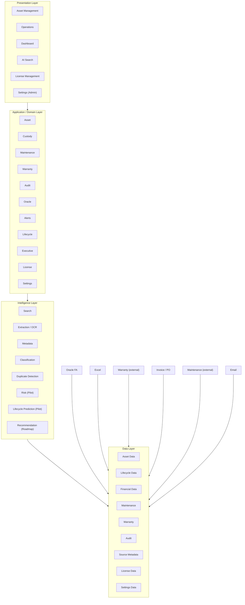

# RAISE Design Document

**Product:** RAISE — Enterprise Asset Intelligence Platform
**Document:** System / Product Design
**Version:** 0.12 Draft
**Status:** Draft for Design Review
**Design Source:** [`RAISE-PRD.md`](../01-requirements/RAISE-PRD.md) v0.14
**Source of Truth:** RAISE PRD
**Reference Only:** VERSCAN

---

## 1. Purpose

This document translates the approved / proposed requirements in
`RAISE-PRD.md` into a logical product and system design.

The design answers:

- How RAISE capabilities are organized
- How users interact with the platform
- How asset data flows through the system
- How Oracle FA and other data sources connect
- How the AI Intelligence Layer operates
- Which responsibilities are deterministic and which use AI
- What must be designed further before implementation

This document does **not** invent final technology choices where the PRD
does not define them.

---

# 2. Design Principles

## 2.1 PRD is the Source of Truth

All design decisions must trace back to a RAISE requirement.

```text
RAISE-PRD.md
     ↓
RAISE-DESIGN.md
     ↓
Prototype
     ↓
Acceptance Criteria
     ↓
Test Plan
```

If a design element cannot be traced to a requirement, it must be
classified as:

- Design Support
- Technical Necessity
- Open Question
- Future / Roadmap

---

## 2.2 VERSCAN is Reference Only

VERSCAN may be used to inspect existing Asset Management workflows and
UX patterns.

It must not be used as an automatic source of RAISE functionality.

```text
VERSCAN
   ↓
Reference / Benchmark
   ↓
Candidate Design Pattern
   ↓
Check against RAISE PRD
   ↓
Use only if required / approved
```

---

## 2.3 Deterministic First

Business-critical operations should use deterministic application logic.

Examples:

- CRUD
- Asset state changes
- Check-in / Check-out
- Approval / workflow rules
- Financial data processing
- Audit logging
- Access control

AI should not replace deterministic rules where exact behavior is
required.

---

## 2.4 AI as an Intelligence Layer

AI is positioned as a layer between connected data sources and business
applications.

```text
Data Sources
     ↓
Data Integration / Normalization
     ↓
AI Intelligence Layer
     ↓
Business Applications
```

---

# 3. Logical System Architecture

## 3.1 High-Level Architecture



### Design Note

The diagram is a logical architecture. It does not prescribe a specific
cloud provider, programming language, database, AI model, or deployment
platform because those are not defined in the PRD.

**Traceability note on Intelligence Layer nodes (updated 2026-08-21 against
PRD v0.3):** `I2` (Extraction/OCR), `I8` (Metadata), `I3` (Classification), and
`I4` (Duplicate Detection) reflect the "Current" AI capabilities named in
[`RAISE-PRD.md`](../01-requirements/RAISE-PRD.md#7-ai-requirements) §7's
capability table. As of PRD v0.3 (§16 Resolved Question 28), these four
capabilities now each have a dedicated Traceability ID at Priority P0 / Scope
MVP — `RAISE-AI-DOC-001` (Extraction/OCR, node `I2`), `RAISE-AI-DOC-002`
(Metadata, node `I8`), `RAISE-AI-DOC-003` (Classification, node `I3`), and
`RAISE-AI-DOC-004` (Duplicate Detection, node `I4`) — matching the treatment
already given to Natural Language Search (`RAISE-AI-SEARCH-001`). This
replaces the prior design note stating these nodes had "no dedicated
Traceability ID ... in the PRD"; that gap is now closed at the PRD identity/
priority/scope level. Detailed acceptance behavior for each of the four
remains **TBD** in the PRD itself, so this design likewise does not assume
document scope, field lists, matching thresholds, or resolution workflows —
see [§9A Document Intelligence Capabilities](#9a-document-intelligence-capabilities-ocrextraction-metadata-classification-duplicate-detection)
below for the design-level detail and open items.

**Traceability note on new License nodes (added 2026-08-21 against PRD v0.5;
priority/scope corrected 2026-08-21 in Design v0.6 against PRD v0.6/v0.7/v0.8):**
`P5` (License Management, Presentation Layer), `A10` (License, Application/Domain
Layer), and `D8` (License Data, Data Layer) are nodes retained to reflect
[`RAISE-FR-LICENSE-001`](../01-requirements/RAISE-PRD.md#raise-fr-license-001--software--saas-license-management)
(Software / SaaS License Management), added to the PRD in v0.5. This requirement
originates from already-built `frontend/src/pages/Licenses/` and
`frontend/src/pages/LicenseDetail/` code, not from the original Hackathon
Proposal (see PRD §16 Resolved Question 34). The requirement's identity,
**priority (Roadmap), and scope (Enterprise Roadmap — not Phase 1 MVP)** are
confirmed — the license field model, renewal/expiry alert rule,
seat/utilization tracking, and vendor/cost tracking are all **TBD** in the
PRD, so this design likewise does not invent a field model or alert rule.
**Correction (2026-08-21, Design v0.6):** this note and the diagram's
placement of `P5`/`A10`/`D8` previously implied Priority P0 / Scope MVP,
matching an earlier, incorrect PRD draft position — the PRD itself has since
corrected this to Roadmap, and this design now matches. The diagram still
shows these nodes in their existing layer positions (they are still valid
logical components), but they must be read as Roadmap-scoped, not MVP, per
[§22 MVP vs Roadmap Design Boundary](#22-mvp-vs-roadmap-design-boundary). See
[§5.3 License Domain](#53-license-domain-enterprise-roadmap) below for
design-level detail and open items.

**Traceability note on new Settings nodes (added 2026-09-01 in Design v0.10
against PRD v0.12, §16 Resolved Question 41):** `P6` (Settings (Admin),
Presentation Layer), `A11` (Settings, Application/Domain Layer), and `D9`
(Settings Data, Data Layer) are new nodes reflecting the platform-level
Settings/configuration domain confirmed as part of
[`RAISE-FR-WARRANTY-001`](../01-requirements/RAISE-PRD.md#raise-fr-warranty-001--warranty)'s
resolution: the "Expiring" warranty threshold is per-Asset-Category
configurable, not a single fixed value, and is edited by an admin through a
Settings UI. Unlike `P5`/`A10`/`D8` (License), these Settings nodes do **not**
carry their own Traceability ID — the PRD does not define a standalone
"Settings" requirement; the Settings domain exists at the design layer only
as the necessary home for `RAISE-FR-WARRANTY-001`'s per-category threshold
configuration, gated by `RAISE-NFR-SEC-RBAC-001` (admin-only access). See
[§5.4 Settings Domain](#54-settings-domain) below for design-level detail.
This is a narrower addition than License Management: no MVP-vs-Roadmap
question applies here, since the underlying requirement
(`RAISE-FR-WARRANTY-001`) is already MVP/APPROVED and this capability has
already been implemented and verified (see §5.4).

---

# 4. Major System Components

## 4.1 Asset Management

Responsible for:

- Asset Registry
- Category & Hierarchy
- Asset lifecycle information
- Asset identity
- Asset status

Requirement traceability:

- `RAISE-FR-ASSET-001`
- `RAISE-FR-ASSET-002`
- `RAISE-FR-LIFE-001`

---

## 4.1A License Management (Enterprise Roadmap)

**Priority:** Roadmap (not MVP-confirmed) · **Scope:** Enterprise Roadmap — not
Phase 1 MVP (corrected 2026-08-21 against PRD v0.6/v0.7/v0.8, §16 Resolved
Question 34; see [Document Status](#document-status) v0.6 change log for the
correction history). This design area was originally recorded here as
"Priority P0, Scope MVP" in Design v0.5 — that was a design-layer error made
before the actual business decision was reflected; the PRD's own correction
note on `RAISE-FR-LICENSE-001` states an earlier PRD pass briefly and
incorrectly recorded Priority P0 / Scope MVP too, before being corrected to
Roadmap. This design now matches the corrected PRD.

Responsible for (Roadmap-phase, not built for MVP):

- License inventory (list view)
- License detail record
- Association of a license with applicable asset(s) and/or holder(s), where
  such an association exists

Requirement traceability:

- `RAISE-FR-LICENSE-001` (Roadmap)

**Status:** design area retained, reclassified from MVP to Roadmap
(2026-08-21 correction, against PRD v0.6+). See [§5.3 License
Domain](#53-license-domain) for the conceptual data flow and TBD items — the
field model, renewal/expiry alert rule, seat/utilization tracking, and
vendor/cost tracking are all **TBD** in the PRD and are not invented here.
See also [§22 MVP vs Roadmap Design Boundary](#22-mvp-vs-roadmap-design-boundary),
where this capability now appears under Roadmap, not MVP.

---

## 4.1B Settings / Platform Configuration

**Status:** new design area, added 2026-09-01 (Design v0.10, PRD v0.12, §16
Resolved Question 41). Not itself a PRD Traceability ID — see [§5.4 Settings
Domain](#54-settings-domain) for full detail.

Responsible for (MVP, scoped narrowly):

- Admin-facing configuration UI (`P6`/`A11`/`D9` in [§3.1](#31-high-level-architecture))
- Warranty "Expiring" threshold configuration, per Asset Category

Requirement traceability:

- `RAISE-FR-WARRANTY-001` (sole current driver)
- `RAISE-FR-ASSET-002` (Category, as the configuration key)
- `RAISE-NFR-SEC-RBAC-001` (admin-only access)

**Not a general Settings framework** — see [§5.4 Settings Domain, "Scope
Boundary"](#54-settings-domain) for the explicit boundary against
scope-creep.

---

## 4.2 Custody & Asset Operations

Responsible for:

- Custody History
- Check-in / Check-out
- QR / Barcode identification
- Asset state transition

Requirement traceability:

- `RAISE-FR-ASSET-003`
- `RAISE-FR-OPS-001`
- `RAISE-FR-OPS-002`

### Conceptual State

```text
                    ┌──────────────┐
                    │   REGISTERED │
                    └──────┬───────┘
                           │
                           ▼
                    ┌──────────────┐
                    │   ASSIGNED   │
                    └──────┬───────┘
                           │
                    Check-out / Transfer
                           │
                           ▼
                    ┌──────────────┐
                    │   IN USE     │
                    └──────┬───────┘
                           │
                         Return
                           │
                           ▼
                    ┌──────────────┐
                    │   CHECK-IN   │
                    └──────┬───────┘
                           │
                           ▼
                 ┌────────────────────┐
                 │ Maintenance / Audit│
                 └─────────┬──────────┘
                           │
                           ▼
                       Disposal
```

**Important:** the diagram above (`REGISTERED → ASSIGNED → IN USE →
CHECK-IN → Maintenance/Audit → Disposal`) remains a conceptual illustration
only — the PRD does not define an exhaustive, named asset-status enumeration
or transition-rule table beyond what is confirmed below for Check-in/
Check-out specifically. General asset status naming/transition rules outside
that one operation remain TBD in the PRD.

### Check-in/Check-out Workflow, Permission Gate, and Holder Model — Resolved 2026-09-01 (PRD v0.13, §16 Resolved Question 42)

Business confirmed all three of the following, resolving PRD Open Questions
11–13 (Open Finding F-02) — matching already-built, already-tested
`frontend/src/services/asset-repository.ts` `assign()`/`checkIn()` behavior
exactly, so no new code accompanies this design sync:

- **Workflow shape (resolves Q11):** Check-in/Check-out (`RAISE-FR-OPS-002`)
  is an **immediate state-change operation** — select a holder and confirm
  (Check-out/Assign), or confirm return (Check-in). There is **no approval
  step, no exception-handling workflow, and no multi-stage process.** This is
  **deliberately simpler** than `RAISE-FR-MAINT-001`'s 4-stage workflow (see
  [§5.1 Maintenance Domain](#51-maintenance-domain)) — the two are confirmed
  as intentionally different shapes, not an inconsistency to reconcile.
- **Permission gate (resolves Q12):** "appropriate permission" in
  `RAISE-FR-OPS-002`'s Acceptance Criteria means **any authenticated user —
  is logged in, not a specific role or permission check.** This matches the
  already-confirmed MVP RBAC enforcement level (UI-only/client-side, backend
  deferred to Roadmap — see [§16 Security Architecture, "MVP Enforcement
  Level"](#16-security-architecture)). It does **not** reopen or answer the
  broader `RAISE-NFR-SEC-RBAC-001` role/permission-matrix content question
  (PRD Open Questions 21–22) for other domains — this resolves this one gate
  only.
- **Holder data model (resolves Q13):** the holder is a **direct 1:1 link to
  an Employee record** (`Asset.assignedEmployeeId`/`assignedTo`). **No
  additional organizational relationship model** (department, team, or
  location-based custody) is needed for MVP. This design does not invent any
  such additional relationship model.

This resolution also settles, narrowly, the previously-open question of
whether Check-in/Check-out is the *only* mechanism that writes Custody
History (`RAISE-FR-ASSET-003`): the confirmed behavior is a single immediate
state-change operation with no separate reassignment/exception path, so this
design continues to group both requirements under one domain component
(Custody & Asset Operations) — consistent with, not a new decision beyond,
the grouping already used in this section.

**Still TBD, not resolved by this confirmation:** the role list and
permission-matrix contents for other domains (`RAISE-NFR-SEC-RBAC-001`, PRD
Open Questions 21–22), and general asset-status naming/transition rules
outside the Check-in/Check-out operation itself.

### IT Hardware Assignment Approval Workflow — Category-Scoped Exception (confirmed 2026-09-02, PRD v0.14, §16 Resolved Question 43)

**This narrows, and does not reopen or reverse, the general Check-in/
Check-out resolution immediately above.** Business confirmed that the
"immediate state-change, no approval step" behavior continues to apply
exactly as resolved to: Check-in for every asset category, and Check-out
(assignment) of every asset category **except IT Hardware**. For Check-out
(assignment) of an asset in the **IT Hardware** Asset Category specifically,
a **4-stage approval workflow** now applies before the asset's status becomes
**Assigned** (the existing status value — unchanged, no new status name is
introduced).

**Real-world source (context, not itself a requirement):** a real Singer
Thailand company form, **"ใบดำเนินการเกี่ยวกับคอมพิวเตอร์และอุปกรณ์"** (IT
Equipment Processing Form, Version 2024), requires 4 physical signatures for
an IT equipment handover. The confirmed digital workflow **explicitly merges**
the paper form's recipient signature and the recipient's-supervisor signature
into one digital step (Stage 2 below) — a deliberate business simplification,
not an oversight — see PRD §16 Resolved Question 43(b) for the full mapping
of paper-form signatures to digital stages.

#### Conceptual Stages

```text
Stage 1                Stage 2                 Stage 3           Stage 4
Initiation        →  Recipient Confirmation  →  IT Processing  →  IT Supervisor Approval
(IT/Admin selects     (assigned employee         (IT_STAFF          (IT_MANAGER gives
 employee, clicks      confirms receipt —         processes/         final approval —
 Assign — same          combines paper form's      handles the        only after this
 trigger as today)      recipient + recipient-     handover)           does asset status
                        supervisor signatures                          become Assigned)
                        into one digital step)
```

- **Stage 1 — Initiation:** an IT/Admin user selects an employee and clicks
  Assign — the same trigger action as the general Check-out flow today. The
  asset does **not** immediately become Assigned; it enters a new pending
  state instead.
- **Stage 2 — Recipient Confirmation:** the assigned employee (the recipient)
  confirms receipt of the equipment themselves, via the app. No timeout,
  reminder, or expiry rule for this stage is defined — **TBD, not invented
  here.**
- **Stage 3 — IT Processing:** an `IT_STAFF` user processes/handles the
  handover.
- **Stage 4 — IT Supervisor Approval:** an `IT_MANAGER` user gives final
  approval. Only after Stage 4 approval does the asset's status become
  **Assigned**.

**No new Role is introduced.** Stage 3/4 actors reuse the existing `IT_STAFF`
and `IT_MANAGER` roles already confirmed under `RAISE-NFR-SEC-RBAC-001` (see
[§16 Security Architecture](#16-security-architecture)) — this is the one
specific case in this document where Check-out is **not** gated merely by "any
authenticated user" (the general `RAISE-FR-OPS-002` rule), but by a specific
role, for Stage 3 and Stage 4 only.

#### Conceptual State Model — New Small Entity, Not Just an `Asset.status` Field

Consistent with the closest existing precedent — `RAISE-FR-MAINT-001`'s
4-stage Maintenance ticket workflow (see [§5.1 Maintenance
Domain](#51-maintenance-domain)) — this workflow needs to track **who the
current actor is** at each stage, not merely a single Asset status value.
This design therefore introduces a new, small conceptual record type (working
name: **Assignment Approval Request**), scoped only to IT Hardware Check-out,
tracking:

- `assetId` — the asset being assigned (must be IT Hardware category)
- `recipientEmployeeId` — the target employee (recipient), same holder
  concept as [§4.2 Holder Model](#check-incheck-out-workflow-permission-gate-and-holder-model--resolved-2026-09-01) above
- current stage / status
- per-stage actor and timestamp (who initiated, who confirmed as recipient,
  which `IT_STAFF` user processed, which `IT_MANAGER` user approved/rejected,
  and when each occurred)
- a terminal `REJECTED` state, including which stage/actor rejected

```text
   ┌──────────────────────────────┐
   │ PENDING_RECIPIENT_CONFIRMATION│  ← created by Stage 1 Initiation
   └───────────────┬───────────────┘
                    │ Stage 2 — Recipient confirms receipt
                    ▼
   ┌──────────────────────────────┐
   │   PENDING_IT_PROCESSING       │
   └───────────────┬───────────────┘
                    │ Stage 3 — IT_STAFF processes
              ┌─────┴─────┐
              ▼           ▼
   ┌────────────────┐  ┌──────────┐
   │PENDING_IT_       │  │ REJECTED │  ← terminal, asset → Available
   │SUPERVISOR_APPROVAL│  └──────────┘
   └────────┬─────────┘
            │ Stage 4 — IT_MANAGER approves
      ┌─────┴─────┐
      ▼           ▼
┌──────────┐  ┌──────────┐
│ ASSIGNED │  │ REJECTED │  ← terminal, asset → Available
└──────────┘  └──────────┘
```

- **Rejection (Stage 3 or Stage 4 only):** rejecting returns the asset
  **immediately to Available** and ends the flow. This is **terminal — no
  reopening** — matching the existing `RAISE-FR-MAINT-001` maintenance-ticket
  `REJECTED_BY_DEPT` terminal-state precedent (see [§5.1 Maintenance
  Domain](#51-maintenance-domain)).
- **No recipient-decline path is defined at Stage 2.** The business was only
  asked about `IT_STAFF`/`IT_MANAGER` rejection (Stages 3–4); whether the
  recipient can decline at Stage 2 is **not decided** and is not invented
  here.
- This state model, and the entity that carries it, are **design-level
  formalizations** of what PRD §16 Resolved Question 43 confirms at the
  business-rule level — field names above (e.g., `recipientEmployeeId`,
  `PENDING_IT_PROCESSING`) are illustrative design vocabulary, not PRD-defined
  identifiers, consistent with how [§5.1 Maintenance
  Domain](#51-maintenance-domain)'s state names are treated.

#### Open Design Point — Custody History Write Timing (genuinely undecided, not invented)

The PRD explicitly flags this as unresolved (PRD's Pre-Finalization Quality
Pass, "Duplicated / Overlapping Requirements," and the corresponding
"Requirements Needing Business Confirmation" bullet, both updated by §16
Resolved Question 43): **whether `RAISE-FR-ASSET-003` Custody History is
written only once — at final (Stage 4) approval — or at each of the 4 stage
transitions individually — is not defined by Resolved Question 43.** This
design does not invent an answer. Two plausible options exist purely as
illustration of the shape of the open question (neither is chosen):

- Write a single Custody History entry only when the asset's status actually
  changes to Assigned (Stage 4 approval) — treating Stages 1–3 as an internal
  pending/approval process with no custody-state change yet.
- Write a Custody History entry (or an equivalent audit-adjacent record) at
  each stage transition — treating the approval process itself as
  custody-relevant activity worth tracing, even before the asset's status
  changes.

This must be resolved by business/PRD confirmation before implementation —
see [§25 Design Open Questions](#25-design-open-questions), new item added
under **Data**.

#### Explicitly Not Designed Here (per PRD's own non-decisions)

Consistent with PRD §16 Resolved Question 43's own explicit non-decisions,
this design does **not** add:

- A "recipient's own supervisor" relationship/field to the Employee data
  model — the business explicitly rejected this in favor of merging Stage 1
  and the paper form's supervisor signature into Stage 2.
- Any PDF/document generation of the physical form.
- Any e-signature or legal-acknowledgment-text capture mechanism for Stage 2.
  The PRD raises this as real-world context (the paper form's liability
  acknowledgment text) but explicitly does **not** decide whether to capture
  it digitally — flagged via the PRD's own `## NEEDS_PRD_CONFIRMATION` note,
  not decided either way here. This design leaves the point exactly as open
  as the PRD does — see [§25 Design Open Questions](#25-design-open-questions).
- Any change to `RAISE-FR-LICENSE-001` (License/software-install tracking) —
  unaffected, confirmed still Roadmap per [§4.1A](#41a-license-management-enterprise-roadmap)/[§5.3](#53-license-domain-enterprise-roadmap).

#### Requirement Traceability

- `RAISE-FR-OPS-002` (primary — category-scoped exception to the general
  Check-in/Check-out behavior)
- `RAISE-FR-ASSET-003` (Custody History — write-timing across the 4 stages is
  the open design point above)
- `RAISE-FR-ASSET-002` (Asset Category — IT Hardware is the category key that
  triggers this exception)
- `RAISE-NFR-SEC-RBAC-001` (Stage 3/4 role gate — `IT_STAFF`/`IT_MANAGER`, no
  new role; see [§16 Security Architecture](#16-security-architecture))

**Disposal is Enterprise Roadmap, not MVP** (resolved 2026-08-21, see
`RAISE-PRD.md` §14 item 7 and §16 Resolved Questions). It remains in this diagram as the
conceptual terminal stage of the asset lifecycle, but no Disposal screen, flow, or data
model is part of the MVP design — no MVP component in §4/§5/§6 below should be read as
implying a disposal capability exists.

---

# 5. Maintenance & Warranty

## 5.1 Maintenance Domain

The maintenance domain stores maintenance information associated with an
asset, including a defined maintenance-request workflow.

Conceptual relationship:

```text
Asset
  │
  ├── Maintenance Record
  │       ├── Date
  │       ├── Event
  │       ├── Status
  │       └── Cost
  │
  └── Maintenance History
```

### Maintenance Request Workflow (confirmed 2026-08-21, PRD v0.5 §16 Resolved Question 33)

The PRD now confirms a **4-stage workflow shape** for `RAISE-FR-MAINT-001`,
originally identified as an ESAPS-reference pattern in
`docs/project-foundation-baseline/ESAPS-UI-FOUNDATION-BASELINE.md` §4:

```text
Stage 1                Stage 2                     Stage 3            Stage 4
User Requisition  →  Dept Approval (Delegated)  →  IT Dispatch  →  Technician Execution
```

- **User Requisition** — a user raises a maintenance request against an asset.
- **Dept Approval (Delegated)** — the request is approved by a department
  approver, who may be a delegated approver per a configurable
  delegated-approver setting.
- **IT Dispatch** — an approved request is dispatched by IT to a
  technician/queue.
- **Technician Execution** — the technician performs the maintenance work
  through to completion.

### Conceptual State Model

```text
   ┌────────────────────────┐
   │ PENDING_DEPT_APPROVAL  │  ← created by User Requisition
   └───────────┬────────────┘
               │ Dept Approval (Delegated)
               ▼
   ┌────────────────────────┐
   │  PENDING_IT_DISPATCH   │
   └───────────┬────────────┘
               │ IT Dispatch
               ▼
   ┌────────────────────────────────────┐
   │ PLANNING / IN_PROGRESS / ON_HOLD   │  ← Technician Execution
   └───────────────────┬─────────────────┘
                        ▼
                     ┌──────┐
                     │ DONE │
                     └──────┘
```

This state model is carried directly from the PRD's Acceptance Criteria for
design reference and must not be extended with additional states without
business confirmation.

**Delegated-approver concept:** the Dept Approval stage may be performed by a
delegated approver per a configurable setting. Delegation configuration rules
(who may delegate, to whom, and how delegation is audited) are **TBD** — see
below.

**Remaining TBD (per PRD §16 Q14, partially resolved):** SLA per stage, the
vendor model (internal technician vs. external vendor dispatch), the cost
model/tracking, and delegated-approver configuration rules are **not**
defined in the PRD and therefore remain TBD in this design as well. This
design does not invent values for any of them.

Requirement:

`RAISE-FR-MAINT-001`

Requirement traceability (RBAC dependency): approval, dispatch, and technician
roles, and the delegated-approver setting, depend on `RAISE-NFR-SEC-RBAC-001`
(TBD, see [§16 Security Architecture](#16-security-architecture)).

---

## 5.2 Warranty Domain

**Status:** field list **resolved 2026-08-29** (PRD §16 Resolved Question 40,
resolving PRD Open Question 15); Expiring-threshold **shape resolved
2026-09-01** (PRD §16 Resolved Question 41, resolving PRD Open Question 15b —
a follow-on to Resolved Question 40, not a reopening of it). For MVP, the
Warranty field remains a single field on the Asset record:

```text
Asset
  │
  └── warrantyExpiry
```

`warrantyExpiry` is already implemented on the Asset record. A draft 8-field
proposal (start date, provider/vendor, type, coverage details, cost, claim
contact, document reference — in addition to expiry) was presented to the
business as a candidate, not a decision; the business explicitly **rejected**
those seven additional fields for MVP scope (not silently deferred). Any of
them would require a separate, future business confirmation before being
added to `RAISE-FR-WARRANTY-001` or this design. This design intentionally
does not model those rejected fields, and Resolved Question 41 below does
**not** reopen or expand that field-list decision.

Requirement:

`RAISE-FR-WARRANTY-001`

### Warranty Status Model — 3-State, Computed (resolved 2026-09-01)

Warranty status is **not** a stored field. It is a derived, 3-state value
computed at read time from `warrantyExpiry` and a threshold:

```text
warrantyExpiry ──┐
                  │
Threshold (days) ─┼──► getWarrantyStatus(warrantyExpiry, thresholdDays, asOf)
                  │
asOf (evaluation ─┘            │
date, "now")                   ▼
                     ┌────────────────────┐
                     │ Active / Expiring  │
                     │     / Expired      │
                     └────────────────────┘
```

- **Active** — `warrantyExpiry` is further away than the threshold.
- **Expiring** — `warrantyExpiry` falls within the threshold window from the
  evaluation date.
- **Expired** — `warrantyExpiry` has already passed.

This 3-state model is a design-level formalization of what the PRD's
Acceptance Criteria for `RAISE-FR-WARRANTY-001` now states directly (see PRD
§6.7, Resolved Question 41): status is computed, not persisted, and the
"Expiring" boundary depends on a threshold value that is **not** a single
global constant (see next subsection).

### Expiring Threshold — Per-Asset-Category Configurable (resolved 2026-09-01)

**Prior state:** the illustrative "90 days" figure in the PRD's original
Business Example was carried in this design (see [§9 Natural Language
Search](#9-natural-language-search)'s example query) as an *illustration
only*, not a confirmed rule — the threshold's value and shape were explicitly
open (PRD Open Question 15b).

**Resolved:** the "Expiring" threshold is **configurable per Asset Category**,
not a single fixed global number. Each of the 5 current Asset Categories (IT
Hardware, Mobile, Office Equipment, Infrastructure, Media Equipment) has its
own threshold, independently adjustable, defaulting to **90 days** for all
five at first setup. This is a scope decision (per-category configurability),
not merely a confirmation of the "90" number itself.

The threshold does **not** live on the Asset or Warranty record — it lives on
a separate, admin-editable configuration record in the new [Settings
Domain](#54-settings-domain):

```text
Asset ── category ──► Asset Category
                            │
                            ▼
                  WarrantySettings[category] = thresholdDays
                            │
                            ▼
              getWarrantyStatus(asset.warrantyExpiry,
                                 thresholdDays, asOf)
```

- **Ownership:** the per-category threshold is a Settings-domain concept, not
  a Warranty-domain field — see [§5.4 Settings Domain](#54-settings-domain)
  for the conceptual data shape (`Record<AssetCategory, thresholdDays>`) and
  admin-editing model.
- **Dependency:** this couples the Warranty domain to
  `RAISE-FR-ASSET-002` (Category & Hierarchy), since the threshold key is the
  Asset Category, and to `RAISE-NFR-SEC-RBAC-001` (admin-only access to edit
  thresholds).
- **Not invented beyond the PRD:** the PRD confirms identity/scope
  (per-category, default 90, admin-adjustable) — this design does not add any
  further threshold dimension (e.g., per-department, per-location) beyond
  per-Asset-Category, since none is stated in the PRD.

### Future AI Use

Warranty information can become an input to:

- Natural-language search
- Risk analysis
- Lifecycle analysis
- Recommendation

---

## 5.3 License Domain (Enterprise Roadmap)

**Status:** design area retained, **Priority Roadmap, Scope Enterprise
Roadmap — not Phase 1 MVP** (corrected 2026-08-21 against PRD v0.6/v0.7/v0.8,
§16 Resolved Question 34). Requirement:
[`RAISE-FR-LICENSE-001`](../01-requirements/RAISE-PRD.md#raise-fr-license-001--software--saas-license-management)
(Software / SaaS License Management). **Correction note:** Design v0.5 stated
"Priority P0, Scope MVP" here — that was incorrect and has been corrected in
this revision to match the PRD's own correction (the PRD itself records that
an earlier PRD pass briefly and incorrectly recorded the same P0/MVP values
before the actual business decision, Roadmap, was received).

**Origin note:** unlike every other requirement in this design, this one has
no basis in the original Hackathon Proposal / v0.1 draft PRD — it formalizes
already-built, tested `frontend/src/pages/Licenses/` and
`frontend/src/pages/LicenseDetail/` code into a requirement (PRD §16 Resolved
Question 34). Only the requirement's identity, priority, and scope are
confirmed; this design therefore intentionally does not invent a field model,
alert rule, or vendor/cost tracking model beyond what the code implies at the
component/data-flow level.

### Conceptual Component & Data Flow

```text
License Inventory (list view)
        │
        ▼
License Detail (single record view)
        │
        ├── Association → Asset(s)   [where such an association exists]
        │
        └── Association → Holder(s)  [where such an association exists]
```

- **License Inventory** — a list view of license records (mirrors
  `frontend/src/pages/Licenses/`).
- **License Detail** — a detail view of a single license record (mirrors
  `frontend/src/pages/LicenseDetail/`).
- Both views are gated by `RAISE-NFR-SEC-RBAC-001` (access control for
  license data, per PRD Dependencies) — TBD pending Security Design.

### Data Model TBD

The following are **not** defined in the PRD and are therefore **not**
invented here — they remain open design/requirement items:

- License field model (what fields constitute a license record)
- Renewal / expiry alert rule
- Seat / utilization tracking
- Vendor / cost tracking

### Relationship to Alerts (Open)

Whether license renewal/expiry should integrate with
[`RAISE-FR-ALERT-001`](#14-alert-architecture) (Alert Architecture) — the same
way warranty expiry does — is explicitly **TBD** in the PRD (§16 Q15a) and is
therefore left as an open design item, not assumed. If confirmed, license
expiry would conceptually feed the same `Business Event → Rule Evaluation →
Alert Created → Authorized User` flow described in §14, but this must not be
built ahead of that confirmation.

### Dependencies

- `RAISE-FR-ASSET-001` (asset association)
- `RAISE-NFR-SEC-RBAC-001` (access control)
- `RAISE-FR-ALERT-001` (relationship TBD, see above)

---

## 5.4 Settings Domain

**Status:** new design area, added 2026-09-01 in Design v0.10 (PRD v0.12, §16
Resolved Question 41). This is **not** itself a PRD Traceability ID — the PRD
does not define a standalone "Settings" requirement. It exists at the design
layer as the necessary home for admin-configurable platform values, currently
driven by exactly one confirmed need: `RAISE-FR-WARRANTY-001`'s per-Asset-Category
"Expiring" threshold.

**Origin note:** this design area is implementation-confirmed, not
speculative — the PRD's Resolved Question 41 cites already-built and verified
code: `frontend/src/types/settings.ts` (new `WarrantySettings` type),
`frontend/src/services/settings-service.ts` and
`frontend/src/services/settings-repository.ts` (seed/read/update), and a new
Settings "Warranty" section/tab in `frontend/src/pages/Settings/index.tsx`.
Per [§2.2 VERSCAN is Reference Only](#22-verscan-is-reference-only)'s
promotion discipline, this design records the *confirmed requirement shape*
(per-category configurability, default 90, admin-only edit), not the
implementation detail itself, as the design-level content.

### Conceptual Component & Data Flow

```text
Settings (Admin) — Presentation
        │
        ▼
Settings Domain — Application/Domain
        │
        ├── WarrantySettings: Record<AssetCategory, thresholdDays>
        │       (one entry per current Asset Category, default 90)
        │
        ▼
Settings Data — persisted configuration record
        │
        ▼
Consumed by: Warranty status computation
             (see §5.2 "Expiring Threshold —
             Per-Asset-Category Configurable")
```

- **Settings (Admin)** — an admin-facing UI surface for viewing and editing
  platform configuration values; for MVP, scoped to exactly one section
  (Warranty thresholds per Asset Category).
- **Settings Domain** — holds configuration state keyed by concept (currently
  only `WarrantySettings`, keyed by Asset Category) and exposes it for read by
  other domains (currently only Warranty status computation) and for
  admin-gated write.
- **Settings Data** — the persisted configuration record(s). This design does
  not assume a specific storage technology (per [§26 Technology
  Selection](#26-technology-selection)).

### Access Control

Write access (editing a category's threshold) is **admin-only**, per
`RAISE-NFR-SEC-RBAC-001`. Consistent with [§16 Security Architecture, "MVP
Enforcement Level"](#16-security-architecture), MVP enforcement of this
admin-only restriction is UI-only/client-side — the same accepted MVP risk
(server-side bypass not blocked) documented there applies here and is not
restated as a new risk.

### Scope Boundary — Not a General Settings Framework

This design area exists **only** to the extent the PRD requires it for
`RAISE-FR-WARRANTY-001`'s threshold. It should **not** be read as authorizing
a general-purpose, multi-section admin Settings framework beyond Warranty
thresholds — any further Settings section (e.g., Alert channel configuration,
future License renewal-alert configuration per [§5.3](#53-license-domain-enterprise-roadmap))
would need its own PRD confirmation before being added here, the same
discipline applied to every other design area in this document.

### Dependencies

- `RAISE-FR-WARRANTY-001` (sole current driver — per-category Expiring
  threshold)
- `RAISE-FR-ASSET-002` (Category & Hierarchy — the configuration key)
- `RAISE-NFR-SEC-RBAC-001` (admin-only write access)

---

# 6. Oracle FA Integration

## 6.1 Logical Design

```text
                 ┌─────────────────┐
                 │    Oracle FA    │
                 └────────┬────────┘
                          │
                          │ Integration
                          ▼
                 ┌─────────────────┐
                 │ Integration     │
                 │ Layer           │
                 └────────┬────────┘
                          │
                 Mapping / Validation
                          │
                          ▼
                 ┌─────────────────┐
                 │ RAISE Asset     │
                 │ Data Context    │
                 └────────┬────────┘
                          │
             ┌────────────┼────────────┐
             ▼            ▼            ▼
          Dashboard     Search      Intelligence
```

## 6.2 Required MVP Capability

The PRD requires:

- Oracle FA Integration
- Import NBV / Depreciation

Requirement:

`RAISE-FR-ORACLE-001`

## 6.3 Integration Design Decisions Still Required

The PRD explicitly leaves these open:

- API vs file integration
- Synchronization frequency
- Data mapping
- Error handling
- Retry mechanism
- Integration ownership
- Source-of-truth rules
- Security mechanism

Therefore the design must not prematurely select one method.

## 6.4 ReconciliationPage / "Phase 6" Label — Not a Design Decision Yet

**Updated 2026-08-21 against PRD v0.9 (§16 Resolved Question 37, Open Question
10a):** `frontend/`'s `ReconciliationPage` (`frontend/src/pages/modules.tsx`)
carries an internal code comment referencing a "Phase 6" once "Oracle FA is
connected." Business has confirmed that **"Phase 6" is a stale/internal-only
label from `frontend/`'s own migration plan and does not correspond to any
phase defined in `RAISE-PRD.md`** — `RAISE-PRD.md` only defines Phase 1 MVP
and Enterprise Roadmap (see [§22 MVP vs Roadmap Design
Boundary](#22-mvp-vs-roadmap-design-boundary)). This design must **disregard
"Phase 6" entirely as a scope or sequencing signal** — it says nothing about
whether, when, or on what `ReconciliationPage` depends.

**This resolves only the label.** The substantive question — **whether
`ReconciliationPage` is intended to satisfy `RAISE-FR-ORACLE-001`'s
reconciliation acceptance behavior, or whether it needs a separate
requirement ID** — remains **explicitly open** in the PRD
([Open Question 10a](../01-requirements/RAISE-PRD.md#16-open-questions)) and
is **not answered by this design**. Accordingly:

- This design does **not** add `ReconciliationPage` as a component of the
  §6.1 Logical Design or of Oracle FA Integration's requirement traceability
  above, because doing so would silently assume an answer to Open Question
  10a.
- No mapping between `ReconciliationPage` and `RAISE-FR-ORACLE-001` — or a new
  requirement ID — should be treated as decided until PRD Open Question 10a
  is resolved by business.
- See also [§25 Design Open Questions, item 15a](#25-design-open-questions)
  below, added to carry this question forward at the design layer.

---

# 7. Data Source Architecture

RAISE connects information from multiple sources.

```text
┌────────────┐
│   Excel    │
└─────┬──────┘
      │
┌─────▼──────┐
│ Oracle FA  │
└─────┬──────┘
      │
┌─────▼──────┐
│  Warranty  │
└─────┬──────┘
      │
┌─────▼──────┐
│ Maintenance│
└─────┬──────┘
      │
┌─────▼──────┐
│ Invoice/PO │
└─────┬──────┘
      │
┌─────▼──────┐
│   Email    │
└─────┬──────┘
      │
      ▼
Integration / Normalization
      │
      ▼
RAISE Intelligence Context
```

## 7.1 Data Normalization

The integration layer should conceptually perform:

```text
Source Data
   ↓
Extract
   ↓
Validate
   ↓
Map
   ↓
Normalize
   ↓
Associate with Asset
   ↓
Store / Index
   ↓
Expose to Applications / AI
```

The exact implementation is TBD.

---

# 8. AI Intelligence Architecture

## 8.1 Hybrid AI Model

RAISE PRD defines two major execution patterns.

### Deterministic / Rule-based

```text
CRUD
Workflow
Business Rules
Access Control
Audit
Financial Processing
```

### LLM / RAG

```text
Natural Language Search
Data Summarization
```

This separation must be preserved.

---

## 8.2 AI Flow

```text
                    User Question
                          │
                          ▼
                 ┌─────────────────┐
                 │ Query / Intent   │
                 │ Understanding    │
                 └────────┬────────┘
                          │
                          ▼
                 ┌─────────────────┐
                 │ Data Retrieval  │
                 │ / RAG           │
                 └────────┬────────┘
                          │
                          ▼
                 ┌─────────────────┐
                 │ Context / Source│
                 │ Validation      │
                 └────────┬────────┘
                          │
                          ▼
                 ┌─────────────────┐
                 │ LLM / Response  │
                 └────────┬────────┘
                          │
                          ▼
                    User Answer
```

### Important Design Rule

The AI response must not invent asset facts.

Where applicable, the response should expose the source information used
to produce the answer.

The exact citation / provenance mechanism remains a design item because
the PRD asks how AI answers should cite source data.

---

# 9. Natural Language Search

Requirement:

`RAISE-AI-SEARCH-001`

## Conceptual Flow

```text
User
 │
 │ "Which notebooks expire
 │  within 90 days?"
 ▼
AI Search
 │
 ▼
Identify intent
 │
 ▼
Retrieve:
 ├── Asset
 ├── Warranty
 ├── Maintenance
 └── Financial data
 │
 ▼
Apply business rules / filters
 │
 ▼
Generate answer
 │
 ▼
Show result + source context
```

The final UI and retrieval technology are TBD.

**Open ambiguity (from PRD Pre-Finalization Quality Pass):** the PRD classifies
Natural Language Search as a "Current" AI capability and lists it as `P0`, but
it is unclear whether "Current" means already prototyped/demoed at the pitch or
simply "intended for MVP." This design treats `RAISE-AI-SEARCH-001` as MVP based
on that classification, consistent with the PRD's own reading — but this should
be confirmed, not assumed settled, before implementation. See
[`RAISE-PRD.md`](../01-requirements/RAISE-PRD.md#ambiguous-requirements).

---

# 9A. Document Intelligence Capabilities (OCR/Extraction, Metadata, Classification, Duplicate Detection)

Requirements:

- `RAISE-AI-DOC-001` (OCR / Extraction)
- `RAISE-AI-DOC-002` (Metadata)
- `RAISE-AI-DOC-003` (Classification)
- `RAISE-AI-DOC-004` (Duplicate Detection)

Status: **Current AI capability, Priority P0, Scope MVP** (confirmed
2026-08-21 via PRD §16 Resolved Question 28). These four capabilities were
previously row labels only in the PRD §7 capability table with no dedicated
requirement; they now have Traceability IDs and MVP scope, consistent with
`RAISE-AI-SEARCH-001`.

## Conceptual Flow

```text
Source Document / Record
 (Invoice, PO, Warranty doc,
  Maintenance doc, Email attachment)
        │
        ▼
 OCR / Extraction (RAISE-AI-DOC-001)
        │
        ▼
 Metadata Generation (RAISE-AI-DOC-002)
        │
        ▼
 Classification (RAISE-AI-DOC-003)
        │
        ▼
 Duplicate Detection (RAISE-AI-DOC-004)
        │
        ▼
 Associate with Asset / Financial / Maintenance / Warranty record
```

This sequencing (Extraction → Metadata → Classification → Duplicate
Detection) is a **design-level convenience grouping only** — the PRD does not
state an execution order between the four capabilities, and each may in
practice run independently or in a different order. This diagram should not
be read as a specified pipeline.

## Design Notes and TBD Items

**Updated 2026-08-21 against PRD v0.4 (§16 Resolved Questions 30–32):**
acceptance detail for `RAISE-AI-DOC-001`, `RAISE-AI-DOC-002`, and
`RAISE-AI-DOC-003` is now business-confirmed. `RAISE-AI-DOC-004` was asked
about in the same session but received no answer and remains fully TBD.

- **OCR / Extraction (`RAISE-AI-DOC-001`):**
  - **Document scope (resolved):** three document types — Invoice/Receipt,
    Warranty document, and Asset nameplate/label (e.g., serial number,
    model).
  - **Confidence-threshold mechanism (resolved):** the system computes a
    confidence score for extracted data; when the score is below a defined
    threshold, the extraction is routed to **human review before it is
    saved to the asset record** — no auto-save below threshold.
  - **Still TBD:** the exact numeric confidence-threshold value itself. The
    mechanism must not be built assuming a specific cutoff number until
    business confirms it.
- **Metadata (`RAISE-AI-DOC-002`):**
  - **Scope (resolved):** three areas — (a) document type tagging, (b)
    key-value field extraction (e.g., vendor, date, amount), (c) search
    tags/keywords for full-text search.
  - **Still TBD (design-phase detail):** exact per-document-type field list
    and how tags/keywords are surfaced to users in the UI.
- **Classification (`RAISE-AI-DOC-003`):**
  - **Mode (resolved):** **suggestion-only** — the capability suggests a
    category/document-type classification; it must **not** auto-assign the
    classification (e.g., into `RAISE-FR-ASSET-002` Category & Hierarchy). A
    human user must review and confirm the suggestion before it is written
    to the record.
  - **Still TBD (design-phase detail):** exact classification taxonomy
    (category list, document-type list) and the human-confirmation
    UI/workflow detail.
- **Duplicate Detection (`RAISE-AI-DOC-004`):** matching criteria/threshold
  and the resolution workflow (auto-merge vs. flag-for-review) remain fully
  **TBD** — explicitly asked of the business in the 2026-08-21 session with
  **no answer received**. Do not infer behavior from the resolution pattern
  used for `RAISE-AI-DOC-001`/`002`/`003` above.

## Hybrid AI Architecture Placement

Consistent with [§2.3 Deterministic First](#23-deterministic-first) and
[§8.1 Hybrid AI Model](#81-hybrid-ai-model): these four capabilities sit in
the AI/LLM-assisted layer (they are listed as "Current" AI capabilities in
PRD §7, not as deterministic CRUD). Per PRD v0.4 confirmation, `RAISE-AI-DOC-001`
(below-threshold extractions) and `RAISE-AI-DOC-003` (classification) are both
**human-review-gated** — neither auto-saves nor auto-assigns without human
confirmation — consistent with [§2.3 Deterministic First](#23-deterministic-first).
`RAISE-AI-DOC-004` (Duplicate Detection) remains fully TBD on this point
(auto-merge vs. flag-for-review not yet decided) and must not bypass
deterministic confirmation/audit logic until the PRD resolves it. This
boundary must be preserved regardless of which capability runs first.

## Dependencies

- `RAISE-FR-ASSET-001` (all four)
- `RAISE-FR-ASSET-002` (Classification, `RAISE-AI-DOC-003`)
- `RAISE-AI-DOC-001` (Metadata, `RAISE-AI-DOC-002`, depends on extraction
  output per PRD)
- Data sources named in PRD §7 intro: Excel, Oracle FA, Warranty,
  Maintenance, Invoice/PO, Email

---

# 10. Risk Scoring

Requirement:

`RAISE-AI-RISK-001`

Status:

**Pilot**

## Conceptual Input

```text
Asset Age
    │
Maintenance History
    │
Warranty Status
    │
Oracle FA
    │
    ▼
Risk Evaluation
    │
    ▼
Risk Score
```

The PRD does not define:

- Formula
- Weight
- Threshold
- Training data
- Model
- Accuracy target

Therefore these must be validated as part of the pilot design.

---

# 11. Lifecycle Prediction

Requirement:

`RAISE-AI-LIFECYCLE-001`

Status:

**Pilot**

Concept:

```text
Historical Asset Data
        │
        ├── Age
        ├── Maintenance
        ├── Warranty
        ├── Financial
        └── Lifecycle
        │
        ▼
Prediction Model
        │
        ▼
Future Lifecycle Signal
```

Prediction target and accuracy criteria are TBD.

---

# 12. AI Recommendation

Requirement:

`RAISE-AI-RECOMMEND-001`

Status:

**Roadmap**

The design should leave an extension point for future recommendations.

Concept:

```text
Connected Data
      │
      ▼
Risk / Prediction
      │
      ▼
Business Rules
      │
      ▼
Recommendation
      │
      ├── Recommended Action
      ├── Reason
      ├── Confidence
      └── Source References
```

This capability must not be treated as mandatory Phase 1 implementation
based on the current PRD.

---

# 13. Executive Intelligence

Requirement:

`RAISE-FR-EXEC-001`

## Status Note — Corrected 2026-08-31 to Match As-Built (Open Finding F-22)

**This section previously documented a "Logical Dashboard" wireframe (NBV/
Risk/Utilization tiles; "Asset Overview" / "Category / Lifecycle / Financial
Overview" / "Executive Summary" sections) that was never built.** Formal test
execution confirmed this gap twice against the same shipped page —
`TC-EXEC-001-01`/`-02` (2026-08-26) and `TC-DASH-01..03` (2026-08-29), both
recorded as [Open Finding
F-22](../project-management/OPEN-FINDINGS.md#confirmed-via-test-execution-not-blocked-on-any-prd-question)
in `OPEN-FINDINGS.md`. Per explicit business decision on F-22, this design is
corrected to document the **actually shipped dashboard** as the current MVP
design, rather than the wireframe that was never built. This is a scope/spec
correction to match reality — it does not add, remove, or reinterpret any PRD
requirement; `RAISE-FR-EXEC-001` continues to cover this dashboard unchanged.

This correction does **not** delete the NBV/Risk/Utilization KPI concept —
those remain PRD-listed proposal KPIs (see "NBV/Risk/Utilization — Proposal
KPIs, Not Yet Implemented" below) and are recorded as a distinct,
not-yet-scheduled enhancement layered on top of the shipped dashboard, not
silently dropped.

## Logical Dashboard — Current MVP (As Built)

The dashboard actually shipped is `frontend/src/pages/Dashboard/index.tsx`,
ported from the legacy ESAPS reference dashboard (predating this PRD/design —
see [§2.2 VERSCAN is Reference Only](#22-verscan-is-reference-only) for the
general promotion-discipline principle this page did not originally go
through). Its KPI grid and section set are different from, and were not
derived from, the original wireframe below.

```text
┌──────────────────────────────────────────────────────────────────────┐
│                         Dashboard (As Built)                        │
├────────────┬────────────┬────────────┬──────────────┬───────────────┤
│Total Assets│ Available  │  Assigned  │In Maintenance│Expired Warranty│
├────────────┼────────────┼────────────┴──────────────┴───────────────┤
│  Software  │  Monthly   │  Monthly Cost                             │
│  Licenses  │Depreciation│  (both illustrative — no depreciation      │
│            │(illustrative)│ model exists yet)                        │
├────────────┴────────────┴────────────────────────────────────────────┤
│ AI Insights                                                          │
│ AI Portfolio Health                                                  │
│ Oracle FA Reconciliation ("Oracle FA Synced")                        │
│ Asset Lifecycle (acquisitions / retirements chart)                   │
│ Department Distribution                                              │
│ Asset Status                                                         │
│ Asset Type                                                           │
│ Pending Approvals                                                    │
│ Recent Activities                                                    │
│ Maintenance Calendar                                                 │
└──────────────────────────────────────────────────────────────────────┘
```

**KPI grid (8 tiles):** Total Assets, Available, Assigned, In Maintenance,
Expired Warranty, Software Licenses, Monthly Depreciation (illustrative — no
depreciation model has been built; see [§6 Oracle FA
Integration](#6-oracle-fa-integration) and [Open Finding
F-31](../project-management/OPEN-FINDINGS.md)), Monthly Cost (illustrative,
same caveat).

**Sections (10):** AI Insights, AI Portfolio Health, Oracle FA Reconciliation
(a.k.a. "Oracle FA Synced" — related to but not a resolution of [Open Finding
F-31](../project-management/OPEN-FINDINGS.md) on the separate `/reconciliation`
Financial View screen), Asset Lifecycle (acquisitions/retirements chart),
Department Distribution, Asset Status, Asset Type, Pending Approvals, Recent
Activities, Maintenance Calendar.

None of these tiles/sections has a PRD-defined field list, formula, or
threshold beyond what the page already computes from existing Asset/
Maintenance/Warranty/License data — this design does not invent one. This
list documents what exists; it is not a new specification for further
development.

## NBV/Risk/Utilization — Proposal KPIs, Not Yet Implemented

The PRD identifies:

- NBV
- Risk
- Utilization

as proposal-defined KPIs under `RAISE-FR-EXEC-001`. **None of the three
appears in the shipped dashboard's KPI grid above.** This is recorded as an
explicit open item — a separate, not-yet-scheduled enhancement layered on top
of the current MVP dashboard, not a silently dropped requirement.

- **Utilization's definition is already resolved** (PRD §16 Resolved
  Questions 27 and 29 — see below); only its *implementation* on the
  dashboard is outstanding.
- **NBV and Risk formulas, thresholds, and dashboard placement remain TBD** —
  see [`RAISE-PRD.md`](../01-requirements/RAISE-PRD.md#16-open-questions) §16
  Q3–Q4, tracked as [Open Finding
  F-03](../project-management/OPEN-FINDINGS.md#blocking-gates-an-mvp-requirement).

**Utilization — Resolved 2026-08-21 (PRD v0.3, §16 Resolved Question 27):**
~~"Utilization" is listed in the PRD as a KPI with no definition~~. Business
confirmed the definition as **assignment-time-based**:

> Utilization = % of time an asset is assigned to a user/department,
> relative to total available time.

This definition is what a future Utilization tile must implement against —
it is not implemented on the shipped dashboard today (see "NBV/Risk/
Utilization — Proposal KPIs, Not Yet Implemented" above).

**Calculation mechanics — Resolved 2026-08-21 (PRD v0.4, §16 Resolved
Question 29):**

- **Aggregation window = real-time snapshot** — Utilization is computed as a
  point-in-time value as of "now"; it is **not** a time-series/period
  aggregation (e.g., not "average utilization over the last 30/90 days").
- **Denominator exclusions** — assets with status Disposed, Retired, or Under
  Maintenance are **excluded** from the "total available time" denominator;
  only assets in an active/available-for-assignment state count toward the
  denominator. This denominator interacts with the Custody domain in
  [§4.2](#42-custody--asset-operations) and the asset lifecycle states in
  [§18 Logical Data Model](#18-logical-data-model), both of which remain
  design-phase TBD for exact status naming.

NBV and Risk KPI formulas remain undefined and unresolved. See
[`RAISE-PRD.md`](../01-requirements/RAISE-PRD.md#8-executive-intelligence) §8
and [`RAISE-PRD.md`](../01-requirements/RAISE-PRD.md#ambiguous-requirements)
Pre-Finalization Quality Pass.

**AI-Generated Executive Summary — open ambiguity (from PRD Pre-Finalization
Quality Pass), status unchanged by this correction:** the PRD's "AI-Generated
Executive Summary" under `RAISE-FR-EXEC-001` does not state whether it is MVP
or Roadmap — its dependency on natural-language summarization sits at the
boundary of what is explicitly "Current" AI capability. It does not appear on
the shipped dashboard as a distinct "Executive Summary" block; the closest
built analogs are the "AI Insights" and "AI Portfolio Health" sections
recorded in the As-Built dashboard above, but this design does **not** assert
that either one satisfies the "AI-Generated Executive Summary" acceptance
behavior — that mapping is unresolved for the same reason `Reconciliation
Page`↔`RAISE-FR-ORACLE-001` is left open in [§6.4](#64-reconciliationpage--phase-6-label--not-a-design-decision-yet).
See [`RAISE-PRD.md`](../01-requirements/RAISE-PRD.md#gaps-between-hackathon-proposal-and-proposed-prd).

---

# 14. Alert Architecture

Requirement:

`RAISE-FR-ALERT-001`

## MVP

The system needs an alert capability.

```text
Business Event
     │
     ▼
Rule Evaluation
     │
     ▼
Alert Created
     │
     ▼
Authorized User
```

Exact MVP alert rules and channels are TBD.

## Roadmap

Multi-channel delivery:

```text
Email
Teams
LINE Notify
```

is Phase 2 / Enterprise Roadmap.

**Design boundary note (from PRD Pre-Finalization Quality Pass):** the
warranty-expiry-within-90-days scenario is used in the PRD to illustrate *both*
this MVP Alert capability (`RAISE-FR-ALERT-001`) and the Roadmap AI
Recommendation capability (`RAISE-AI-RECOMMEND-001`). These are not the same
requirement — MVP Alert scope must stay a simple rule-triggered notification
and must not be over-built to match the richer Roadmap recommendation example
(recommended action, confidence, reason, source references). See
[`RAISE-PRD.md`](../01-requirements/RAISE-PRD.md#duplicated--overlapping-requirements).

---

# 15. Audit Architecture

Requirement:

`RAISE-FR-AUDIT-001`

## Concept

```text
User / System Action
        │
        ▼
Audit Event
        │
        ▼
Immutable Audit Store
        │
        ▼
Audit Review
```

Audit events should conceptually contain enough information to support
traceability.

Potential attributes requiring confirmation:

- Actor
- Timestamp
- Action
- Entity
- Before / After
- Source
- Result

These are design candidates, not finalized PRD requirements.

The PRD still requires definition of:

- Retention
- Storage architecture
- Event taxonomy
- Privileged administrator controls

---

# 16. Security Architecture

The PRD requires a later Security Design.

Logical model:

```text
User
 │
 ▼
Authentication
 │
 ▼
Authorization / RBAC
 │
 ▼
Application
 │
 ├── Asset Data
 ├── Financial Data
 ├── Maintenance
 ├── Warranty
 ├── AI
 └── Audit
```

## Security Design Work Items

- Authentication mechanism
- Authorization model
- Role definitions
- Data access boundaries
- AI data access control
- Sensitive data handling
- Integration credentials
- Administrative access

No specific technology is selected by this design.

## MVP Enforcement Level — Resolved 2026-08-21 (PRD v0.9, §11, §16 Resolved Question 38)

Requirement: `RAISE-NFR-SEC-RBAC-001`.

Business has confirmed **where** enforcement happens for MVP — this is a
narrower question than the full RBAC model above, and must not be read as
resolving it:

- **A UI-only (client-side) permission-matrix is acceptable for the
  Hackathon MVP.** Backend-enforced RBAC is **not required to ship Phase 1**
  — it is explicitly deferred to **Enterprise Roadmap / Phase 2**.
- This matches the enforcement pattern already present in the reference
  source trees per `CLAUDE.md` (`frontend/` route guards + a client-side
  permission-matrix persistence layer; `go-template-main`'s `RequireRole`
  middleware wired only as a reference example on one CRUD group, not as a
  production backend admin/user/role management API). This design treats
  those as **reference implementation patterns only**, consistent with
  [§2.2 VERSCAN is Reference Only](#22-verscan-is-reference-only)'s promotion
  discipline — it does not treat either template as an approved RAISE
  architecture decision beyond the enforcement-level point the PRD itself
  confirms.
- **Security caveat (carried from PRD, not dropped):** UI-only enforcement
  means an actor who bypasses the client (e.g., direct API calls) is not
  blocked by a server-side check for MVP. This is recorded as an **accepted,
  explicit MVP risk**, to be visible to a future `RAISE-COMPLIANCE-REVIEW.md`
  as a known gap to close before Phase 2 production hardening — not an
  oversight of this design.

**Still fully TBD — this decision does not resolve any of it:** the actual
**role list**, **permission matrix contents**, and **authentication
mechanism** remain undefined in the PRD (Open Questions 21–23). This design
does **not** assume or invent any role model, role name, or permission
structure as a result of the enforcement-level decision above — the
enforcement-level answer only fixes *where* a future permission check would
run, not *what* the roles/permissions are. All Security Design Work Items
listed earlier in this section (Role definitions, Authorization model,
Authentication mechanism, etc.) remain open exactly as before this update.

Every MVP component elsewhere in this design that references role/permission
gating (e.g., [§4.2 Custody & Asset Operations](#42-custody--asset-operations),
[§5.1 Maintenance Domain](#51-maintenance-domain)'s approval/dispatch/
technician roles, [§5.3 License Domain](#53-license-domain)'s access control,
[§5.4 Settings Domain](#54-settings-domain)'s admin-only threshold-edit
access, [§15 Audit Architecture](#15-audit-architecture)'s privileged
administrator controls) continues to depend on `RAISE-NFR-SEC-RBAC-001` as
**TBD** for role content — only the client-side-vs-backend enforcement
question is now answered, and only for MVP.

**Exception — one specific gate is fully resolved, not just its enforcement
level:** `RAISE-FR-OPS-002` (Check-in/Check-out) in [§4.2](#42-custody--asset-operations)
is confirmed (PRD §16 Resolved Question 42, 2026-09-01) to require **any
authenticated user, no role check at all** — "appropriate permission" means
simply "is logged in." This is narrower than, and does not answer, the
general role/permission-matrix content question above for any other
component in this list.

**Further narrowing — one specific sub-case now requires a role check
(2026-09-02, PRD §16 Resolved Question 43):** for Check-out (assignment) of
an asset in the **IT Hardware** category specifically, Stage 3 (IT
Processing) and Stage 4 (IT Supervisor Approval) of the new [IT Hardware
Assignment Approval Workflow](#it-hardware-assignment-approval-workflow--category-scoped-exception-confirmed-2026-09-02-prd-v014-16-resolved-question-43)
require the actor to hold the `IT_STAFF` role (Stage 3) or `IT_MANAGER` role
(Stage 4) respectively — **not** merely "any authenticated user." No new
Role is introduced; both roles already exist in the confirmed Role set from
Resolved Question 42's own Q12 resolution. This is the one place in this
document where `RAISE-FR-OPS-002` is gated by a specific role rather than by
authentication alone — it applies **only** to IT Hardware Check-out Stages 3
and 4; Stage 1 (Initiation) and Stage 2 (Recipient Confirmation) are not
role-restricted beyond being the specific actor named at that stage
(IT/Admin at Stage 1, the recipient employee at Stage 2). It does not extend
role-gating to Check-in, to any other asset category, or to any other
domain's role/permission content.

---

# 16A. Other Non-Functional Requirements — Design Backlog

[`RAISE-PRD.md`](../01-requirements/RAISE-PRD.md#10-non-functional-requirements)
§10 records an NFR backlog that is broader than `RAISE-NFR-SEC-RBAC-001`
(covered in [§16 Security Architecture](#16-security-architecture) above).
The PRD explicitly states it does **not** define detailed NFR values for
these areas — they are a requirements backlog, not invented specifications —
so this design likewise does not assign any value, target, or mechanism to
them. This section exists only so that each area has an explicit design
placeholder, rather than silently having no design representation at all.

| NFR Area (PRD §10) | Design Status |
|---|---|
| Authentication | TBD — see [§16 Security Architecture](#16-security-architecture) Security Design Work Items (mechanism not yet selected) |
| Authorization / RBAC | MVP enforcement level (UI-only/client-side) resolved — see [§16 Security Architecture, "MVP Enforcement Level"](#16-security-architecture); role list/permission contents remain TBD |
| Performance | TBD — no target defined in PRD; no design mechanism proposed |
| Availability | TBD — no target defined in PRD; no design mechanism proposed |
| Scalability | TBD — no target defined in PRD; no design mechanism proposed |
| Backup / Recovery | TBD — no policy defined in PRD; no design mechanism proposed |
| Data Retention | TBD — no policy defined in PRD; interacts with [§15 Audit Architecture](#15-audit-architecture)'s retention item and `RAISE-FR-LICENSE-001`/warranty data, but no retention period is assumed anywhere in this design |
| Encryption | TBD — no requirement defined in PRD; no design mechanism proposed |
| API Security | TBD — no requirement defined in PRD; relates to [§19 API / Integration Boundary](#19-api--integration-boundary), which also leaves authentication/endpoint definitions TBD |
| Audit Retention | TBD — no retention period defined in PRD; see [§15 Audit Architecture](#15-audit-architecture) "Retention" item, which already carries this as an open item |
| Monitoring | TBD — no requirement defined in PRD; no design mechanism proposed |
| Logging | TBD — no requirement defined in PRD; distinct from the business-facing Audit Log in [§15](#15-audit-architecture), which is an application-domain requirement, not an operational logging NFR |

None of these areas is assumed resolved, and none is assigned a design
mechanism, technology, or numeric target — doing so would invent content the
PRD explicitly leaves as backlog. This table exists purely for traceability
completeness; see the cross-check note in [§24 Design
Traceability](#24-design-traceability).

---

# 17. Primary User Interaction Model

## IT Asset

```text
Login
 ↓
Asset Registry
 ↓
Search / Scan
 ↓
View / Update Asset
 ↓
Custody / Maintenance / Warranty
 ↓
Audit
```

## Finance

```text
Login
 ↓
Financial Asset View
 ↓
Oracle FA Data
 ↓
NBV / Depreciation
 ↓
Reconciliation / Analysis
```

## Executive

```text
Login
 ↓
Executive Dashboard
 ↓
KPI
 ↓
Asset Insight
 ↓
Summary
```

## Auditor

```text
Login
 ↓
Asset / History
 ↓
Custody History
 ↓
Audit Log
 ↓
Traceability
```

These are logical journeys derived from the PRD user groups and
requirements. Detailed UX is deferred to Prototype.

---

# 18. Logical Data Model

The PRD does not define a final database schema. The following is a
conceptual model for design discussion.

```text
                    ┌──────────────┐
                    │    ASSET     │
                    └──────┬───────┘
                           │
       ┌───────────────────┼────────────────────┐
       │                   │                    │
       ▼                   ▼                    ▼
  CATEGORY             CUSTODY              WARRANTY
                           │
                           ▼
                      MAINTENANCE

       ASSET
         │
         ├────────────── FINANCIAL
         │                 │
         │                 └── NBV / Depreciation
         │
         ├────────────── QR / BARCODE
         │
         └────────────── LIFECYCLE

All significant system activities
         │
         ▼
    AUDIT LOG
```

## Data Model TBD

The following require detailed design:

- Asset master fields
- Category hierarchy
- Holder model — **resolved for MVP** (direct 1:1 link to an Employee record,
  `Asset.assignedEmployeeId`/`assignedTo`; no department/team/location-based
  custody model; PRD §16 Resolved Question 42, resolving PRD Open Question
  13; see [§4.2 Custody & Asset Operations](#42-custody--asset-operations)),
  retained here only because the other data model TBD items are still open.
- IT Hardware Assignment Approval Request — **new small entity, added
  2026-09-02** (PRD §16 Resolved Question 43): a category-scoped (IT
  Hardware only) record tracking `assetId`, `recipientEmployeeId`,
  current stage/status, per-stage actor/timestamp, and a terminal `REJECTED`
  state — see [§4.2, "IT Hardware Assignment Approval
  Workflow"](#it-hardware-assignment-approval-workflow--category-scoped-exception-confirmed-2026-09-02-prd-v014-16-resolved-question-43).
  Field names are design-level vocabulary, not PRD-defined identifiers.
  Whether/how this entity's transitions feed `RAISE-FR-ASSET-003` Custody
  History is an **open design point**, not resolved here.
- Maintenance fields
- Warranty fields — **resolved for MVP** (`warrantyExpiry` only; PRD §16
  Resolved Question 40; see [§5.2 Warranty Domain](#52-warranty-domain)),
  retained here only because the other data model TBD items are still open.
  The Warranty status Expiring-threshold value (per-Asset-Category,
  default 90 days) is also **resolved** (PRD §16 Resolved Question 41) but
  lives on a separate `WarrantySettings` configuration record in the new
  [§5.4 Settings Domain](#54-settings-domain), not on the Warranty/Asset
  record itself — it is not an additional Warranty field.
- Financial fields
- Oracle mapping
- Lifecycle state model
- Audit event model

---

# 19. API / Integration Boundary

The design should maintain clear boundaries between domains.

```text
                 ┌──────────────────┐
                 │ Presentation     │
                 └────────┬─────────┘
                          │
                    Application APIs
                          │
        ┌─────────────────┼──────────────────┐
        ▼                 ▼                  ▼
     Asset API       Operations API      AI API
        │                 │                  │
        ▼                 ▼                  ▼
     Asset Data       Lifecycle         Intelligence
                                            │
                                     Data Retrieval
                                            │
                              ┌─────────────┼─────────────┐
                              ▼             ▼             ▼
                           Oracle         Internal      External
                           / Sources      Data          Sources
```

The exact API style, authentication and endpoint definitions are TBD.

---

# 20. Error Handling Principles

Because integration and AI depend on external / connected data, the
system should distinguish:

```text
SUCCESS
PARTIAL_SUCCESS
VALIDATION_ERROR
SOURCE_UNAVAILABLE
INTEGRATION_ERROR
AUTHORIZATION_ERROR
AI_UNABLE_TO_ANSWER
DATA_CONFLICT
```

These are proposed design states and must be validated before
implementation.

---

# 21. Data Conflict Handling

The PRD explicitly asks:

> What happens when source data conflicts?

Therefore the design requires a source-of-truth policy before
implementation.

Conceptual flow:

```text
Source A ──┐
           │
Source B ──┼──► Conflict Detection
           │
Source C ──┘
                  │
                  ▼
             Resolution Rule
                  │
            ┌─────┴─────┐
            ▼           ▼
        Resolved     Escalate
```

The actual source priority rules are TBD.

---

# 22. MVP vs Roadmap Design Boundary

## MVP

```text
Asset Registry
Category / Hierarchy
Custody History
QR / Barcode
Check-in / Check-out (IT Hardware Check-out (assign) only: 4-stage approval
  workflow — Initiation → Recipient Confirmation → IT Processing → IT
  Supervisor Approval — confirmed 2026-09-02; all other categories and all
  Check-in remain immediate state-change)
Maintenance (4-stage workflow shape confirmed 2026-08-21)
Warranty (3-state status; Expiring threshold per-Asset-Category configurable, default 90 days — confirmed 2026-09-01)
Settings (Warranty threshold configuration — new design area, 2026-09-01)
Oracle FA Integration
NBV / Depreciation
Alerts
Immutable Audit Log
```

## Current / AI Capability Classification

```text
OCR / Extraction
Metadata
Classification
Duplicate Detection
Natural Language Search
```

## Pilot

```text
Risk Scoring
Lifecycle Prediction
```

## Roadmap

```text
AI Recommendation
Real-time ERP Integration
Native Mobile App
Predictive Analytics
Workflow Automation
Multi-channel Alerts
Asset Disposal Workflow
Software / SaaS License Management (RAISE-FR-LICENSE-001)
```

**Asset Disposal Workflow** was confirmed as Enterprise Roadmap (not MVP) by
Product/Business decision on 2026-08-21 (see [`RAISE-PRD.md`](../01-requirements/RAISE-PRD.md)
§14 item 7 and §16 Resolved Questions, item 26). It remains the conceptual terminal stage
of the asset lifecycle diagram in [§4.2](#42-custody--asset-operations), but no MVP
component in §4–§6 implies a working disposal capability.

**Software / SaaS License Management (`RAISE-FR-LICENSE-001`)** — **moved from the
MVP list to this Roadmap list in Design v0.6.** Design v0.5 had incorrectly placed
this item under MVP ("Priority P0, Scope MVP" — see the §4.1A/§5.3 correction notes)
before the design layer caught up with the PRD's own already-corrected position
(Roadmap, per §16 Resolved Question 34). See [§4.1A License
Management](#41a-license-management-enterprise-roadmap) and [§5.3 License
Domain](#53-license-domain-enterprise-roadmap).

## Out of Scope (No Design Area — By Business Decision)

The following ESAPS-reference-only pages/flows are confirmed **out of RAISE scope
entirely** (not MVP, not Pilot, not Roadmap) by business decision, 2026-08-21, per
[`RAISE-PRD.md`](../01-requirements/RAISE-PRD.md#15-out-of-scope) §15 and §16
Resolved Question 35. They receive **no design area, no component, and no
Traceability ID at any tier** in this document:

- `Assignment.tsx` — asset assignment flow (beyond `RAISE-FR-OPS-002`
  Check-in/Check-out)
- `Auth.tsx` beyond Login (registration/password-reset/MFA-type screens)
- `Inventory.tsx` (distinct from `RAISE-FR-ASSET-001` Asset Registry)
- `NotificationCenter.tsx` (distinct from `RAISE-FR-ALERT-001` Alerts)
- `Profile.tsx` (user self-service profile page)
- `Reports.tsx` (distinct from `RAISE-FR-EXEC-001` Executive Dashboard)
- `ErrorPages.tsx` (404/500/etc.) — treated as generic application
  infrastructure, not a business requirement; no design area needed at any tier

(`SoftwareLicense.tsx`, also named in the same PRD resolution, is not a
separate rejection — it is the same underlying feature as `RAISE-FR-LICENSE-001`
and is already covered, as Roadmap, in [§4.1A](#41a-license-management-enterprise-roadmap)/
[§5.3](#53-license-domain-enterprise-roadmap) above.)

None of the seven items above should be promoted into a design area, `frontend/`
build scope, or a Traceability ID unless a fresh Business Requirement Review
reopens them per the PRD's [VERSCAN Reference Policy promotion
path](../01-requirements/RAISE-PRD.md#verscan-reference-policy) analog.

The classification must remain aligned with the PRD until Product Review
changes it.

---

# 23. Prototype Preparation

The next Prototype should be derived from this design and the PRD.

Recommended initial screen groups:

```text
1. Login / Access
2. Asset Dashboard
3. Asset Registry
4. Asset Detail
5. QR / Barcode Operation
6. Check-in / Check-out
7. Maintenance
8. Warranty
9. Oracle / Financial Asset View
10. Audit History
11. Executive Dashboard
12. AI Natural Language Search
```

### Important

The screen list is a **prototype planning proposal**, not an approved UI
requirement.

Each screen must be traced to one or more PRD requirements before being
treated as mandatory.

---

# 24. Design Traceability

| PRD Requirement | Design Area |
|---|---|
| RAISE-FR-ASSET-001 | Asset Management |
| RAISE-FR-ASSET-002 | Category / Hierarchy |
| RAISE-FR-ASSET-003 | Custody (§4.2 — holder model resolved 2026-09-01: direct 1:1 link to Employee record) |
| RAISE-FR-OPS-001 | QR / Barcode |
| RAISE-FR-OPS-002 | Check-in / Check-out (§4.2 — general workflow shape and permission gate resolved 2026-09-01: immediate state-change, any authenticated user; **narrowed 2026-09-02**: IT Hardware Check-out (assign) only requires a new 4-stage approval workflow — see §4.2 "IT Hardware Assignment Approval Workflow" — all other categories and all Check-in unaffected) |
| RAISE-FR-MAINT-001 | Maintenance (§5.1 — 4-stage workflow shape confirmed) |
| RAISE-FR-WARRANTY-001 | Warranty (§5.2 — field list resolved 2026-08-29: `warrantyExpiry` only; 3-state status + per-Asset-Category Expiring threshold, default 90 days, resolved 2026-09-01) / Settings (§5.4 — threshold configuration home) |
| RAISE-FR-LICENSE-001 | License Management — **Roadmap, not MVP** (§4.1A, §5.3; corrected 2026-08-21) |
| RAISE-FR-ORACLE-001 | Oracle Integration |
| RAISE-FR-ALERT-001 | Alert Architecture |
| RAISE-FR-AUDIT-001 | Audit Architecture |
| RAISE-FR-EXEC-001 | Executive Dashboard |
| RAISE-FR-LIFE-001 | Lifecycle |
| RAISE-AI-SEARCH-001 | AI Search |
| RAISE-AI-DOC-001 | Document Intelligence Capabilities (§9A) |
| RAISE-AI-DOC-002 | Document Intelligence Capabilities (§9A) |
| RAISE-AI-DOC-003 | Document Intelligence Capabilities (§9A) |
| RAISE-AI-DOC-004 | Document Intelligence Capabilities (§9A) |
| RAISE-AI-RISK-001 | Risk Scoring |
| RAISE-AI-LIFECYCLE-001 | Lifecycle Prediction |
| RAISE-AI-RECOMMEND-001 | Recommendation Extension |

**Cross-check against [`RAISE-PRD.md`](../01-requirements/RAISE-PRD.md) §17 (Requirement
Traceability Matrix, PRD v0.9):** every PRD requirement ID has a corresponding design
area above, including the four `RAISE-AI-DOC-001`–`RAISE-AI-DOC-004` rows added
2026-08-21 to match PRD v0.3 §16 Resolved Question 28, and the `RAISE-FR-LICENSE-001`
row (Roadmap — corrected 2026-08-21 in Design v0.6 to match the PRD's own correction to
Priority Roadmap / Scope Enterprise Roadmap, §16 Resolved Question 34; Design v0.5 had
incorrectly carried this row as MVP). `RAISE-FR-MAINT-001`'s design area (§5.1) was
updated, not newly added, to reflect the PRD-confirmed 4-stage workflow shape (§16
Resolved Question 33). One PRD item, `RAISE-NFR-SEC-RBAC-001`, is intentionally not a
row here because it is covered structurally by [§16 Security
Architecture](#16-security-architecture) rather than a single design area — no gap,
just a different mapping shape. **As of Design v0.7 (PRD v0.9), §16 Security
Architecture's new "MVP Enforcement Level" subsection also covers the
`RAISE-NFR-SEC-RBAC-001` MVP-enforcement-level confirmation (§16 Resolved Question 38:
UI-only/client-side for MVP, backend deferred to Roadmap) — role list, permission
matrix contents, and authentication mechanism remain TBD and are not assumed resolved
by this mapping.** The remaining PRD §10 NFR backlog areas (Performance, Availability,
Scalability, Backup/Recovery, Data Retention, Encryption, API Security, Audit
Retention, Monitoring, Logging) have no dedicated Traceability ID in the PRD (only
`RAISE-NFR-SEC-RBAC-001` does), so they are not rows in this table either — they are
instead given an explicit design placeholder in [§16A Other Non-Functional
Requirements — Design Backlog](#16a-other-non-functional-requirements--design-backlog),
added in Design v0.8, so that no PRD-referenced area is silently absent from this
document. `RAISE-FR-ORACLE-001`'s design area (§6, now including new §6.4) was
updated, not newly added, to record that the "Phase 6" code-comment label is confirmed
not a PRD phase (§16 Resolved Question 37) while the substantive
`ReconciliationPage`↔`RAISE-FR-ORACLE-001` mapping question (Open Question 10a) remains
open and is not inferred. The six ESAPS-reference-only pages plus `ErrorPages.tsx`
confirmed out of scope entirely (PRD §16 Resolved Question 35) are intentionally **not**
rows here either — see [Out of Scope (No Design Area)](#out-of-scope-no-design-area--by-business-decision)
under §22. **As of Design v0.10 (PRD v0.12, §16 Resolved Question 41):** the
`RAISE-FR-WARRANTY-001` row above now also covers the confirmed 3-state
Active/Expiring/Expired status model and the per-Asset-Category Expiring
threshold (default 90 days, admin-adjustable). The threshold's home — a new
[§5.4 Settings Domain](#54-settings-domain) — is a design-layer addition, not
a new PRD Traceability ID, so it does not get its own row in this table; it
is cross-referenced from the `RAISE-FR-WARRANTY-001` row instead, the same
pattern used for `RAISE-NFR-SEC-RBAC-001` being covered structurally rather
than as a standalone row. **As of Design v0.12 (PRD v0.14, §16 Resolved
Question 43):** the `RAISE-FR-OPS-002` row above now also covers the new
IT-Hardware-category-scoped 4-stage assignment approval workflow. The new
"Assignment Approval Request" entity this introduces (§4.2, §18) is a
design-layer addition, the same treatment as the Settings domain and
Maintenance's ticket entity — it carries no independent PRD Traceability ID
and is cross-referenced from the `RAISE-FR-OPS-002`/`RAISE-FR-ASSET-003`/
`RAISE-FR-ASSET-002` rows instead.

---

# 25. Design Open Questions

These must be resolved before implementation. (Superset of PRD §16, restated in
design-relevant grouping — not a new set of questions.)

## Business

1. What is the authoritative asset master?
2. Which asset types are in MVP?
3. What is utilization? — **Resolved 2026-08-21** (PRD v0.3 §16 Resolved
   Question 27, mechanics resolved in PRD v0.4 §16 Resolved Question 29):
   definition confirmed as assignment-time-based; calculation mechanics
   confirmed as real-time snapshot with Disposed/Retired/Under-Maintenance
   denominator exclusions (see [§13 Executive Intelligence](#13-executive-intelligence)).
   NBV/Risk KPI formulas remain open.
4. What is risk?
5. What business decision should AI support first?

## Data

6. What is the asset master schema?
7. What is the category hierarchy?
8. What is the holder model? — **Resolved 2026-09-01** (PRD v0.13, §16
   Resolved Question 42, resolving PRD Open Question 13): a direct 1:1 link
   to an Employee record (`Asset.assignedEmployeeId`/`assignedTo`); no
   additional department/team/location-based custody model — see
   [§4.2 Custody & Asset Operations](#42-custody--asset-operations).
8a. Does assigning (Check-out) IT Hardware require an approval workflow,
   unlike the general Check-in/Check-out rule? — **Resolved 2026-09-02** (PRD
   v0.14, §16 Resolved Question 43, narrowing but not reopening Resolved
   Question 42): yes, for IT Hardware Check-out only — a 4-stage approval
   workflow (Initiation → Recipient Confirmation → IT Processing → IT
   Supervisor Approval), reusing existing `IT_STAFF`/`IT_MANAGER` roles — see
   [§4.2, "IT Hardware Assignment Approval
   Workflow"](#it-hardware-assignment-approval-workflow--category-scoped-exception-confirmed-2026-09-02-prd-v014-16-resolved-question-43).
   **Still open, not decided by this resolution:** (i) whether/how each of
   the 4 stages writes to `RAISE-FR-ASSET-003` Custody History (only on final
   approval, or at each stage transition); (ii) whether the legal-
   acknowledgment-text/e-signature capture implied by the real paper form's
   liability clause should be built — the PRD's own `##
   NEEDS_PRD_CONFIRMATION` note on this remains open and is not answered
   here; (iii) any Stage 2 timeout/reminder/expiry rule; (iv) whether the
   recipient can decline at Stage 2 (only `IT_STAFF`/`IT_MANAGER` rejection,
   at Stages 3–4, is defined).
9. What fields are required for maintenance? — workflow **shape** confirmed
   2026-08-21 (PRD v0.5 §16 Resolved Question 33, see
   [§5.1 Maintenance Domain](#51-maintenance-domain)); SLA per stage, vendor
   model, cost model, and delegated-approver configuration rules remain
   open.
10. What fields are required for warranty? — **Resolved 2026-08-29** (PRD §16
   Resolved Question 40, resolving PRD Open Question 15): for MVP,
   `warrantyExpiry` is the only Warranty field. The remaining seven draft
   fields (start date, provider/vendor, type, coverage details, cost, claim
   contact, document reference) are explicitly rejected for MVP, not
   deferred — see [§5.2 Warranty Domain](#52-warranty-domain).
9a. What is the "Expiring" warranty threshold — a single fixed global number
   or something else? — **Resolved 2026-09-01** (PRD §16 Resolved Question
   41, resolving PRD Open Question 15b, a follow-on to Resolved Question 40
   that does not reopen the field-list decision above): per-Asset-Category
   configurable, default 90 days for all 5 current categories, admin-editable
   via a new Settings UI — see [§5.2 Warranty Domain, "Expiring
   Threshold"](#52-warranty-domain) and [§5.4 Settings
   Domain](#54-settings-domain).
10a. What is the license field model, renewal/expiry alert rule,
   seat/utilization tracking, and vendor/cost tracking for
   `RAISE-FR-LICENSE-001`? — new open question, added 2026-08-21 against PRD
   v0.5 (§16 Open Question 15a); see
   [§5.3 License Domain](#53-license-domain).

## Oracle

11. Oracle FA version/system?
12. Required fields?
13. Source of truth for financial data?
14. Synchronization frequency?
15. Integration method?
15a. Does `frontend/`'s `ReconciliationPage` placeholder
    (`frontend/src/pages/modules.tsx`) satisfy `RAISE-FR-ORACLE-001`'s
    reconciliation acceptance criteria, or does it need a separate
    requirement ID? — added 2026-08-21 against PRD v0.9 ([Open Question
    10a](../01-requirements/RAISE-PRD.md#16-open-questions)). The unrelated
    "Phase 6" code-comment labeling question is resolved (not a PRD phase,
    §16 Resolved Question 37) — this mapping question is **not**; see
    [§6.4](#64-reconciliationpage--phase-6-label--not-a-design-decision-yet).
    (Note: this design's own numbering already uses "10a" above under **Data**
    for the unrelated `RAISE-FR-LICENSE-001` field-model question, inherited
    from earlier design revisions before this restated-grouping numbering
    diverged from the PRD's §16 numbering — this new item is numbered "15a"
    here, under **Oracle**, to avoid colliding with that existing entry. Do
    not confuse the two "10a"/"15a" labels across the PRD and this design.)

## AI

16. Which AI capabilities are mandatory for the Hackathon implementation?
17. Which sources can AI access?
18. How are source citations shown?
19. What confidence threshold is acceptable? — **Partially resolved
    2026-08-21** (PRD v0.4 §16 Resolved Question 30) for `RAISE-AI-DOC-001`:
    mechanism confirmed (below-threshold → human review before save); the
    numeric threshold value itself remains TBD.
20. How are conflicting sources handled?
20a. `RAISE-AI-DOC-004` (Duplicate Detection) matching threshold and
    merge-vs-flag workflow — explicitly asked of the business 2026-08-21 and
    left unanswered; remains fully TBD, see [§9A](#9a-document-intelligence-capabilities-ocrextraction-metadata-classification-duplicate-detection).

## Security

21. Authentication mechanism?
22. Roles and permissions? — **Enforcement-level sub-question resolved
    2026-08-21** (PRD v0.9, §16 Resolved Question 38): UI-only/client-side
    enforcement is acceptable for MVP; backend enforcement is deferred to
    Roadmap. The role list and permission matrix **contents** themselves
    remain fully open — see [§16 Security Architecture, "MVP Enforcement
    Level"](#16-security-architecture). **One specific gate additionally
    resolved 2026-09-01** (PRD v0.13, §16 Resolved Question 42): the
    `RAISE-FR-OPS-002` Check-in/Check-out permission check is "any
    authenticated user, no role restriction" — see [§4.2 Custody & Asset
    Operations](#42-custody--asset-operations). This does not extend to any
    other domain's role/permission content. **Further narrowed 2026-09-02**
    (PRD v0.14, §16 Resolved Question 43): for IT Hardware Check-out
    specifically, Stage 3 and Stage 4 of the new assignment approval workflow
    **do** require a specific role (`IT_STAFF`, `IT_MANAGER` respectively) —
    see [§16 Security Architecture](#16-security-architecture), "Further
    narrowing." No new role introduced; this remains scoped to IT Hardware
    Check-out Stages 3–4 only.
23. Sensitive data?
24. Immutable audit event definition?
25. Retention period?

---

# 26. Technology Selection

The PRD does **not** define a final technology stack.

Therefore this design intentionally does not select:

- Frontend framework
- Backend framework
- Database technology
- Cloud provider
- AI model
- Vector database
- Integration middleware
- Messaging platform
- Deployment platform

These should be selected after:

1. Functional design
2. Data model
3. Integration requirements
4. Security requirements
5. AI evaluation requirements

Technology choices must support the PRD rather than redefine it.

---

# 27. Design Review Gate

Before moving to Prototype, confirm:

- [ ] Every MVP requirement has a design representation
- [ ] No VERSCAN feature was added without RAISE requirement support
- [ ] Oracle integration boundary is defined enough for prototype
- [ ] Asset lifecycle model is accepted
- [ ] User journeys are accepted
- [ ] AI / deterministic boundary is accepted
- [ ] Security design work items are identified
- [ ] Data model open questions are tracked
- [ ] Roadmap capabilities are not accidentally included in MVP
- [ ] Design traceability is complete
- [ ] PRD §10 NFR backlog areas each have an explicit design placeholder (not silently omitted)

---

# 28. Next Deliverable

After Design Review:

```text
RAISE-PRD.md
      ↓
RAISE-DESIGN.md       ← Current
      ↓
RAISE-PROTOTYPE
      ↓
RAISE-ACCEPTANCE-CRITERIA.md
      ↓
RAISE-TEST-PLAN.md
      ↓
RAISE-TEST-CASES.md
      ↓
RAISE-TRACEABILITY-MATRIX.md
      ↓
Development
      ↓
RAISE-COMPLIANCE-REVIEW.md
```

---

## Document Status

**Version:** 0.12 (sync with PRD v0.14, §16 Resolved Question 43: new
IT-Hardware-category-scoped 4-stage assignment approval workflow —
Initiation → Recipient Confirmation → IT Processing → IT Supervisor
Approval — narrowing, not reopening, Resolved Question 42's general
Check-in/Check-out resolution. Documentation-only sync; no code change.)

**Change Log — v0.11 → v0.12 (sync with PRD v0.13 → v0.14: IT Hardware
Check-out category-scoped 4-stage approval-workflow exception confirmed;
PRD §16 Resolved Question 43, narrowing PRD §16 Resolved Question 42):**

1. **New "IT Hardware Assignment Approval Workflow" subsection added to
   [§4.2 Custody & Asset Operations](#42-custody--asset-operations).**
   Documents the 4-stage workflow (Initiation → Recipient Confirmation → IT
   Processing → IT Supervisor Approval) scoped only to Check-out (assign) of
   IT Hardware category assets, the real-world Singer Thailand paper-form
   source (context only), the conceptual state model (new small
   "Assignment Approval Request" entity — `assetId`, `recipientEmployeeId`,
   stage/status, per-stage actor/timestamp, terminal `REJECTED` state —
   modeled after `RAISE-FR-MAINT-001`'s Maintenance ticket pattern per §5.1,
   the closest existing precedent), and an explicit "Explicitly Not Designed
   Here" list matching the PRD's own non-decisions (no recipient-supervisor
   Employee field, no PDF generation, no e-signature/acknowledgment-text
   capture, `RAISE-FR-LICENSE-001` unaffected).
2. **Open design point recorded, not invented:** whether/how each of the 4
   stages individually writes to `RAISE-FR-ASSET-003` Custody History (only
   on final approval, or at each stage transition) is explicitly flagged as
   genuinely undecided — the PRD itself raises this and does not answer it
   (Pre-Finalization Quality Pass, updated by Resolved Question 43). This
   design presents two illustrative, unchosen options only to show the shape
   of the open question, and does not select either.
3. **§16 Security Architecture** — new "Further narrowing" paragraph added
   after the existing "Exception" note, recording that IT Hardware Check-out
   Stages 3–4 require the `IT_STAFF`/`IT_MANAGER` roles specifically (not
   "any authenticated user") — the one place in this document where
   `RAISE-FR-OPS-002` is role-gated rather than merely authentication-gated.
   No new role introduced.
4. **§18 Logical Data Model** — new "IT Hardware Assignment Approval
   Request" TBD-list entry added, cross-referencing §4.2 and flagging the
   Custody-History write-timing question as open.
5. **§22 MVP vs Roadmap Design Boundary** — Check-in/Check-out MVP line
   annotated with the new category-scoped exception.
6. **§24 Design Traceability** — `RAISE-FR-OPS-002` row text updated; cross-
   check note explains the new "Assignment Approval Request" entity is a
   design-layer addition (no independent PRD Traceability ID), the same
   treatment as the Settings domain and Maintenance's ticket entity.
7. **§25 Design Open Questions** — new Data item 8a added (workflow
   confirmed; Custody-History write-timing, e-signature/acknowledgment-text
   capture, Stage 2 timeout, and Stage 2 recipient-decline path all remain
   explicitly open); Security item 22 annotated with the further narrowing.
8. **No `## NEEDS_PRD_CONFIRMATION` signal raised by this design pass.**
   Every change traces to an already-resolved PRD decision (§16 Resolved
   Question 43) and reuses an already-confirmed Role set (`IT_STAFF`,
   `IT_MANAGER`, from Resolved Question 42). The PRD's own still-open
   sub-question (e-signature/legal-acknowledgment-text capture) is carried
   forward as a design open question (§25, Data item 8a) exactly as open as
   the PRD leaves it — this design does not invent an answer to it, and does
   not raise its own separate confirmation request beyond what the PRD
   already flags.
9. Header metadata updated: Version bumped to 0.12; Design Source updated to
   reference PRD v0.14.

**Change Log — v0.10 → v0.11 (sync with PRD v0.12 → v0.13: Check-in/
Check-out (`RAISE-FR-OPS-002`) confirmed as an immediate state-change
operation with no approval/exception-handling workflow; permission gate
confirmed as any authenticated user, no role restriction; Custody History
(`RAISE-FR-ASSET-003`) holder data model confirmed as a direct 1:1 link to an
Employee record — no additional org-relationship model. Documentation-only
sync; no code change.)

**Change Log — v0.10 → v0.11 (sync with PRD v0.12 → v0.13: Check-in/Check-out
workflow shape, permission gate, and holder data model resolved; PRD §16
Resolved Question 42, resolving PRD Open Questions 11–13 / Open Finding
F-02):**

1. **`RAISE-FR-OPS-002` / `RAISE-FR-ASSET-003` resolved in [§4.2 Custody &
   Asset Operations](#42-custody--asset-operations).** New subsection
   "Check-in/Check-out Workflow, Permission Gate, and Holder Model — Resolved
   2026-09-01" replaces the prior "Open ambiguity" paragraph, confirming: (a)
   an immediate state-change operation, no approval/exception-handling
   workflow, deliberately simpler than `RAISE-FR-MAINT-001`'s 4-stage
   workflow; (b) permission = any authenticated user, no role restriction,
   matching the already-confirmed MVP UI-only RBAC enforcement level (§16
   Resolved Question 38); (c) holder = direct 1:1 link to an Employee record,
   no department/team/location-based custody model. This also narrowly
   resolves the prior open question of whether Check-in/Check-out is the only
   mechanism writing Custody History. No new field, workflow step, or role
   was invented — this matches already-built, already-tested
   `frontend/src/services/asset-repository.ts` `assign()`/`checkIn()`
   behavior exactly; **no code change accompanies this sync.**
2. **§16 Security Architecture** — new "Exception" note added after the
   "Every MVP component elsewhere..." cross-reference list, recording that
   the `RAISE-FR-OPS-002` permission gate (unlike every other RBAC-gated
   component listed) is now fully resolved, not just its enforcement level.
3. **§18 Logical Data Model** — "Holder model" TBD item marked resolved,
   pointing to §4.2, retained in the list only because sibling data-model TBD
   items remain open.
4. **§24 Design Traceability** — `RAISE-FR-ASSET-003` and `RAISE-FR-OPS-002`
   row text updated to record the 2026-09-01 resolution.
5. **§25 Design Open Questions** — Data item 8 (holder model) marked
   resolved; Security item 22 annotated with the one specific
   `RAISE-FR-OPS-002` gate now resolved, without extending resolution to any
   other domain's role/permission content.
6. **No `## NEEDS_PRD_CONFIRMATION` signal raised.** Every change in this
   pass traces to an already-resolved PRD decision (§16 Resolved Question 42)
   and already-implemented, already-verified code
   (`frontend/src/services/asset-repository.ts`). No field, workflow step, or
   role was invented beyond this confirmation.
7. Header metadata updated: Version bumped to 0.11; Design Source updated to
   reference PRD v0.13.

**Change Log — v0.9 → v0.10 (sync with PRD v0.9 → v0.12: Warranty Expiring
threshold resolved as per-Asset-Category configurable; new Settings design
area added):**

1. **`RAISE-FR-WARRANTY-001` Expiring-threshold shape bound to design** (PRD
   v0.12, §16 Resolved Question 41, resolving PRD Open Question 15b — a
   follow-on to Resolved Question 40, which stays in force unchanged):
   [§5.2 Warranty Domain](#52-warranty-domain) rewritten with two new
   subsections — "Warranty Status Model — 3-State, Computed" (Active /
   Expiring / Expired, derived from `warrantyExpiry` + threshold + `asOf`,
   not a stored field) and "Expiring Threshold — Per-Asset-Category
   Configurable" (per-category threshold, default 90 days for all 5 current
   Asset Categories, admin-editable, not a single global constant). The
   field-list decision from Resolved Question 40 (`warrantyExpiry` only) is
   explicitly carried forward as **not reopened** by this change.
2. **New Settings design area added.** New [§4.1B Settings / Platform
   Configuration](#41b-settings--platform-configuration) component and new
   [§5.4 Settings Domain](#54-settings-domain) conceptual data flow, added as
   the home for the per-category `WarrantySettings` threshold configuration.
   This is a design-layer addition only — it does **not** carry its own PRD
   Traceability ID (the PRD defines no standalone "Settings" requirement); it
   is scoped narrowly to `RAISE-FR-WARRANTY-001`'s confirmed need, with an
   explicit "Scope Boundary — Not a General Settings Framework" subsection to
   prevent scope-creep into a general admin-configuration framework the PRD
   does not define.
3. **§3.1 architecture diagram updated** with new nodes `P6` (Settings
   (Admin)), `A11` (Settings), and `D9` (Settings Data), plus a new
   traceability note explaining why these nodes carry no independent
   Traceability ID (unlike the License nodes `P5`/`A10`/`D8`).
4. **§16 Security Architecture** — the "Every MVP component elsewhere..."
   cross-reference list updated to include the Settings domain's admin-only
   threshold-edit access, under the same MVP UI-only/client-side enforcement
   level and TBD role-content caveats as every other RBAC-gated component.
5. **§18 Logical Data Model** — Warranty fields TBD note updated to record
   that the Expiring threshold is resolved but lives on a separate
   `WarrantySettings` configuration record (Settings domain), not as an
   additional Warranty/Asset field.
6. **§22 MVP vs Roadmap Design Boundary** — MVP list annotated: Warranty line
   now notes the 3-state status and per-category threshold; new "Settings"
   line added.
7. **§24 Design Traceability** — `RAISE-FR-WARRANTY-001` row text updated;
   cross-check note explains the Settings domain is cross-referenced from
   that row rather than given its own row, the same treatment as
   `RAISE-NFR-SEC-RBAC-001`.
8. **§25 Design Open Questions** — new item 9a added (Data section) recording
   the threshold question as resolved, distinct from and not reopening item
   10 (field list).
9. **No `## NEEDS_PRD_CONFIRMATION` signal raised.** Every change in this
   pass traces to an already-resolved PRD decision (§16 Resolved Question
   41) and an already-implemented, already-verified capability
   (`frontend/src/types/settings.ts`,
   `frontend/src/services/settings-service.ts`,
   `frontend/src/services/settings-repository.ts`, `frontend/src/lib/
   warranty.ts`, `frontend/src/pages/Settings/index.tsx`, per the PRD's own
   Resolved Question 41 entry). No field was invented beyond `warrantyExpiry`
   (Resolved Question 40 stays in force); no threshold dimension beyond
   per-Asset-Category was added; the Settings domain was scoped as narrowly
   as the PRD supports, with an explicit boundary note against expanding it
   further without a fresh PRD confirmation.
10. Header metadata updated: Version bumped to 0.10; Design Source updated to
   reference PRD v0.12.

**Change Log — v0.8 → v0.9 (§13 Executive Intelligence corrected to match the
as-built dashboard, per explicit business decision on [Open Finding
F-22](../project-management/OPEN-FINDINGS.md#confirmed-via-test-execution-not-blocked-on-any-prd-question);
PRD remains v0.9, no PRD change):**

1. **Root cause.** [§13 Executive Intelligence](#13-executive-intelligence)'s
   "Logical Dashboard" wireframe (NBV/Risk/Utilization tiles; "Asset
   Overview" / "Category / Lifecycle / Financial Overview" / "Executive
   Summary" sections) was never built. Formal test execution confirmed this
   twice against the same shipped page, `frontend/src/pages/Dashboard/
   index.tsx` (ported from the legacy ESAPS reference dashboard, predating
   this PRD/design) — `TC-EXEC-001-01`/`-02` (2026-08-26) and
   `TC-DASH-01..03` (2026-08-29) — recorded as Open Finding F-22 in
   `OPEN-FINDINGS.md`. Business explicitly decided to fix this design to
   match the shipped app, rather than change the app to match the old
   design/wireframe.
2. **§13 rewritten** with a new "Status Note — Corrected 2026-08-31 to Match
   As-Built (Open Finding F-22)" explaining the correction, a new "Logical
   Dashboard — Current MVP (As Built)" wireframe/tile list documenting the
   real shipped KPI grid (Total Assets, Available, Assigned, In Maintenance,
   Expired Warranty, Software Licenses, Monthly Depreciation (illustrative),
   Monthly Cost (illustrative)) and section set (AI Insights, AI Portfolio
   Health, Oracle FA Reconciliation, Asset Lifecycle, Department
   Distribution, Asset Status, Asset Type, Pending Approvals, Recent
   Activities, Maintenance Calendar), and a new "NBV/Risk/Utilization —
   Proposal KPIs, Not Yet Implemented" subsection recording those three as a
   separate, not-yet-scheduled enhancement layered on top of the current MVP
   dashboard — **not** deleted, **not** silently dropped.
3. **`RAISE-FR-EXEC-001` unchanged.** This is a scope/spec correction to
   match reality, not a new requirement — the PRD requirement continues to
   cover this dashboard exactly as before. No `## NEEDS_PRD_CONFIRMATION`
   signal is raised: the business decision on F-22 is already confirmed, and
   nothing new is being requested of PRD scope.
4. **No new formula, threshold, or field invented.** Utilization's
   definition and calculation mechanics (already resolved per PRD §16
   Resolved Questions 27/29) are unchanged and are now explicitly framed as
   "not yet implemented on the dashboard" rather than implied by an
   unbuilt wireframe. NBV and Risk formulas remain TBD, per PRD §16 Q3–Q4 /
   Open Finding F-03 — no formula or threshold is added here.
5. **"AI-Generated Executive Summary" ambiguity preserved, not resolved.**
   The prior "Open ambiguity" note (MVP vs. Roadmap status undecided in the
   PRD) is retained; this pass only adds that the shipped dashboard has no
   distinct "Executive Summary" block, and explicitly declines to assert
   that "AI Insights" / "AI Portfolio Health" satisfy that requirement's
   acceptance behavior — that mapping question is left open, the same
   pattern used for `ReconciliationPage`↔`RAISE-FR-ORACLE-001` in §6.4.
6. **Header metadata updated:** Version bumped to 0.9; Design Source
   unchanged (still PRD v0.9 — PRD content re-read and found unchanged since
   the v0.8 sync).
7. **Downstream sync still owed.** `RAISE-PROTOTYPE.md` (P-002, P-014) and
   `RAISE-ACCEPTANCE-CRITERIA.md` (`AC-EXEC-001-*`, `AC-DASH-*`) still specify
   the old NBV/Risk/Utilization tile set that Open Finding F-22 found does
   not exist — those documents need their own sync pass to reflect this same
   as-built correction; that sync is outside this design-document change.

**Change Log — v0.7 → v0.8 (design-completeness gap closure; PRD remains
v0.9, no PRD change):**

1. **PRD §10 NFR backlog given an explicit design placeholder.** Re-reading
   [`RAISE-PRD.md`](../01-requirements/RAISE-PRD.md#10-non-functional-requirements)
   §10 against this design found that the broader NFR backlog (Performance,
   Availability, Scalability, Backup/Recovery, Data Retention, Encryption,
   API Security, Audit Retention, Monitoring, Logging) had **no design area
   at all** anywhere in this document — only `RAISE-NFR-SEC-RBAC-001`
   (Authorization/RBAC) had one, via §16 Security Architecture. New
   [§16A Other Non-Functional Requirements — Design
   Backlog](#16a-other-non-functional-requirements--design-backlog) added
   directly after §16, listing each area's design status as **TBD**,
   carrying forward the PRD's own "not sufficiently specified, do not invent"
   framing without assigning any value, target, or mechanism. This does not
   change scope or add a requirement — every one of these areas was already
   named in the PRD as an undefined backlog item; this pass only makes sure
   the design document does not silently omit them.
2. **[§24 Design Traceability](#24-design-traceability) cross-check note
   updated** to explain why the PRD §10 NFR backlog areas are not rows in the
   traceability table (they carry no dedicated Traceability ID in the PRD,
   unlike `RAISE-NFR-SEC-RBAC-001`) and to point to the new §16A placeholder
   instead, so the "no gap" reasoning stays auditable in one place.
3. **[§27 Design Review Gate](#27-design-review-gate)** gained a new
   checklist item confirming the PRD §10 NFR backlog areas each have an
   explicit design placeholder.
4. **No new requirement, capability, or technology choice was invented.**
   This pass only adds structural placeholders for content the PRD already
   states as backlog/TBD — no `## NEEDS_PRD_CONFIRMATION` signal is raised,
   because nothing found in this pass requires a capability the PRD does not
   already acknowledge (the PRD itself names all eleven NFR areas in §10; it
   simply has not yet assigned values to them).
5. Header metadata updated: Version bumped to 0.8; Design Source unchanged
   (still PRD v0.9 — PRD content was re-read in full during this pass and
   found unchanged from the v0.7 sync).

**Change Log — v0.6 → v0.7 (sync with PRD v0.8 → v0.9: RBAC MVP enforcement
level confirmed; Oracle FA "Phase 6" label confirmed not a PRD phase, mapping
question carried forward as Open Question 10a):**

1. **`RAISE-NFR-SEC-RBAC-001` MVP enforcement level bound to design** (PRD
   v0.9, §11, §16 Resolved Question 38): new **"MVP Enforcement Level"**
   subsection added under [§16 Security
   Architecture](#16-security-architecture) recording that a UI-only
   (client-side) permission-matrix is acceptable for MVP, with
   backend-enforced RBAC explicitly deferred to Enterprise Roadmap / Phase 2,
   plus the associated security caveat (client-bypass risk, accepted for
   MVP). **This design explicitly does not treat the role list, permission
   matrix contents, or authentication mechanism as resolved** — those remain
   TBD exactly as before, per the PRD's own framing that this decision fixes
   only *where* enforcement happens, not *what* the roles/permissions are. No
   role model of any kind (names, hierarchy, permission set) has been
   invented or assumed at the design layer as a result of this update.
   [§24 Design Traceability](#24-design-traceability)'s cross-check note and
   [§25 Design Open Questions](#25-design-open-questions) Q22 updated to
   reference the enforcement-level resolution without implying the broader
   RBAC content question is answered.
2. **`RAISE-FR-ORACLE-001` / Oracle FA Reconciliation clarified** (PRD v0.9,
   §16 Resolved Question 37, Open Question 10a): new [§6.4
   ReconciliationPage / "Phase 6" Label — Not a Design Decision
   Yet](#64-reconciliationpage--phase-6-label--not-a-design-decision-yet)
   records that the "Phase 6" code-comment label on `frontend/`'s
   `ReconciliationPage` is confirmed **not** a PRD phase and must be
   disregarded as a scope/sequencing signal — but that the substantive
   question of whether `ReconciliationPage` satisfies
   `RAISE-FR-ORACLE-001`'s reconciliation acceptance behavior, or needs a
   separate requirement ID, **remains open** and is **not** answered or
   inferred by this design. `ReconciliationPage` is therefore **not** added
   as a component of §6.1's Logical Design or of `RAISE-FR-ORACLE-001`'s
   requirement traceability. New Q15a added under [§25 Design Open
   Questions, Oracle](#25-design-open-questions) to carry this forward at the
   design layer (numbered 15a here, distinct from this design's pre-existing
   Q10a on the unrelated License field-model question — the two documents'
   internal numbering has diverged; see the note attached to the new Q15a
   entry).
3. **Header metadata updated:** Version bumped to 0.7; Design Source updated
   to reference PRD v0.9.
4. **No new design area was invented, and no requirement was newly added or
   removed.** Both PRD v0.9 changes are clarifications/confirmations of
   existing requirements (`RAISE-NFR-SEC-RBAC-001`, `RAISE-FR-ORACLE-001`)
   already covered by this design's structure — no `##
   NEEDS_PRD_CONFIRMATION` signal is raised by this pass.

**Change Log — v0.5 → v0.6 (correction pass: License Management scope fix +
out-of-scope acknowledgment; PRD advanced v0.5 → v0.6 → v0.7 → v0.8 across
sessions in between):**

1. **`RAISE-FR-LICENSE-001` (Software / SaaS License Management) scope
   corrected from MVP to Roadmap.** Design v0.5 had recorded this design area
   as "Priority P0, Scope MVP" in both [§4.1A License
   Management](#41a-license-management-enterprise-roadmap) and [§5.3 License
   Domain](#53-license-domain-enterprise-roadmap) — this was a design-layer
   defect, not a business decision; the PRD itself confirms the actual
   business decision was **Priority Roadmap, Scope Enterprise Roadmap** (see
   PRD §16 Resolved Question 34, and the PRD's own note that an earlier PRD
   draft briefly and incorrectly recorded P0/MVP before that decision was
   received). This design now matches the corrected PRD:
   - §4.1A and §5.3 headings and body text updated to Roadmap / Enterprise
     Roadmap, with the correction explicitly noted in place (not silently
     fixed).
   - §3.1 architecture diagram traceability note for nodes `P5`/`A10`/`D8`
     corrected to Roadmap.
   - [§22 MVP vs Roadmap Design Boundary](#22-mvp-vs-roadmap-design-boundary):
     "Software / SaaS License Management" removed from the MVP list and added
     to the Roadmap list, with a correction note.
   - [§24 Design Traceability](#24-design-traceability): `RAISE-FR-LICENSE-001`
     row annotated as Roadmap, not MVP; cross-check note updated.
2. **Out-of-scope acknowledgment added for six ESAPS-reference-only pages
   plus `ErrorPages.tsx`** (`Assignment.tsx`, `Auth.tsx` beyond Login,
   `Inventory.tsx`, `NotificationCenter.tsx`, `Profile.tsx`, `Reports.tsx`,
   `ErrorPages.tsx`), per PRD §15 Out of Scope and §16 Resolved Question 35.
   This design never previously referenced these pages as an unresolved
   design item, so there was nothing stale to remove — a new **[Out of Scope
   (No Design Area)](#out-of-scope-no-design-area--by-business-decision)**
   subsection under §22 now explicitly records that these seven items receive
   no design area, component, or Traceability ID at any tier, and why. §24's
   cross-check note also references this subsection so the "no gap" reasoning
   is auditable in one place. `SoftwareLicense.tsx` (named in the same PRD
   resolution) is noted as already covered by the `RAISE-FR-LICENSE-001`
   Roadmap design area above, not a separate rejection.
3. **`RAISE-AI-RECOMMEND-001` (§12 AI Recommendation) reviewed — no change
   needed.** This design area already correctly states Status: Roadmap, with
   no MVP subset and an explicit "must not be treated as mandatory Phase 1
   implementation" caveat, consistent with the PRD's re-confirmation (§16
   Resolved Question 36) that it stays Roadmap-only.
4. **Header metadata updated:** Version bumped to 0.6; Design Source updated
   to reference PRD v0.8 (the PRD advanced through v0.6 and v0.7 with no
   design-relevant changes beyond the License correction and out-of-scope
   confirmation already captured above; see PRD's own Document Status change
   log for the intervening PRD-only edits, e.g. the Oracle FA "Phase 6"
   labeling resolution, which does not require a design change since the
   substantive `RAISE-FR-ORACLE-001`/`ReconciliationPage` question remains
   open per PRD §16 Resolved Question 37 and Open Question 10a — no design
   action possible until that is answered).
5. No other PRD requirement was found to be missing design coverage, and no
   new `## NEEDS_PRD_CONFIRMATION` signal is raised by this pass — every
   change above corrects this design's alignment with an *existing*,
   already-resolved PRD decision; nothing new was invented at the design
   layer.

**Change Log — v0.4 → v0.5 (sync with PRD v0.4 → v0.5, plus catch-up on the
PRD v0.4 acceptance-detail items not yet reflected in design v0.4):**

1. **`RAISE-FR-MAINT-001` (Maintenance) 4-stage workflow shape bound to
   design** (PRD v0.5, §16 Resolved Question 33): [§5.1 Maintenance
   Domain](#51-maintenance-domain) now documents the confirmed workflow
   (User Requisition → Dept Approval (Delegated) → IT Dispatch → Technician
   Execution) and the state model
   (`PENDING_DEPT_APPROVAL → PENDING_IT_DISPATCH → PLANNING/IN_PROGRESS/ON_HOLD → DONE`),
   including the delegated-approver concept. SLA per stage, vendor model,
   cost model, and delegated-approver configuration rules remain TBD, carried
   forward unchanged from the PRD — not invented here.
2. **New design area added for `RAISE-FR-LICENSE-001`** (Software / SaaS
   License Management, PRD v0.5, §16 Resolved Question 34): new
   [§4.1A License Management](#41a-license-management) component and new
   [§5.3 License Domain](#53-license-domain) conceptual data flow. Field
   model, renewal/expiry alert rule, seat/utilization tracking,
   vendor/cost tracking, and the relationship to `RAISE-FR-ALERT-001` all
   remain TBD per the PRD — not invented here. §3.1 architecture diagram
   updated with new nodes `P5` (License Management), `A10` (License), and
   `D8` (License Data).
3. **Catch-up: `RAISE-AI-DOC-001`/`002`/`003` acceptance detail bound to
   design** (PRD v0.4, §16 Resolved Questions 30–32 — PRD advanced from v0.3
   to v0.4 to v0.5 across sessions; this design was last synced to v0.3 and
   had not yet reflected the v0.4 acceptance-detail resolutions until now):
   [§9A Document Intelligence Capabilities](#9a-document-intelligence-capabilities-ocrextraction-metadata-classification-duplicate-detection)
   updated with the confirmed document scope and confidence-threshold
   mechanism for `RAISE-AI-DOC-001` (numeric threshold value still TBD),
   confirmed metadata scope for `RAISE-AI-DOC-002`, and confirmed
   suggestion-only mode for `RAISE-AI-DOC-003`. `RAISE-AI-DOC-004` remains
   fully TBD (asked, not answered) and is explicitly called out as such so it
   is not mistaken for having followed the same resolution pattern. Hybrid AI
   Architecture Placement note updated accordingly.
4. **Catch-up: Utilization KPI calculation mechanics bound to design** (PRD
   v0.4, §16 Resolved Question 29): [§13 Executive Intelligence](#13-executive-intelligence)
   updated with the confirmed real-time-snapshot aggregation window and the
   Disposed/Retired/Under-Maintenance denominator exclusions. NBV and Risk
   KPI formulas remain open.
5. **§22 MVP vs Roadmap Design Boundary updated:** Maintenance line annotated
   with the confirmed workflow-shape status; License Management added to the
   MVP list.
6. **§24 Design Traceability updated:** new row for `RAISE-FR-LICENSE-001`;
   `RAISE-FR-MAINT-001` row annotated with its updated design area reference;
   cross-check note updated to reference PRD v0.5.
7. **§25 Design Open Questions updated:** Q3 (utilization) marked fully
   resolved on the mechanics point (NBV/Risk formulas still open); Q9
   (maintenance fields) annotated with the confirmed workflow shape and
   remaining TBD items; new Q10a added for the license field model/alert
   rule/tracking questions; Q19 (AI confidence threshold) annotated with the
   partial resolution for `RAISE-AI-DOC-001`; new Q20a added for the
   unresolved `RAISE-AI-DOC-004` matching/merge question.
8. No PRD requirement was found to be missing design coverage after this
   pass — see the Design Traceability cross-check note in §24. No new
   `## NEEDS_PRD_CONFIRMATION` signal was raised by this sync; all design
   additions map to an existing PRD requirement ID and preserve every TBD
   marker the PRD itself carries (no TBD was resolved at the design layer).

**Change Log — v0.3 → v0.4 (sync with PRD v0.2 → v0.3):**

1. **Four new AI requirement IDs bound to design.** PRD v0.3 (§16 Resolved
   Question 28) added `RAISE-AI-DOC-001` (OCR/Extraction), `RAISE-AI-DOC-002`
   (Metadata), `RAISE-AI-DOC-003` (Classification), and `RAISE-AI-DOC-004`
   (Duplicate Detection) at Priority P0 / Scope MVP. This design now: (a)
   updates the §3.1 Intelligence Layer traceability note to bind nodes `I2`,
   `I8`, `I3`, `I4` to these IDs instead of stating "no dedicated
   Traceability ID"; (b) adds new [§9A Document Intelligence
   Capabilities](#9a-document-intelligence-capabilities-ocrextraction-metadata-classification-duplicate-detection)
   describing conceptual flow, TBD acceptance items (carried forward unchanged
   from the PRD, not invented), and Hybrid AI Architecture placement; (c)
   adds four rows to the §24 Design Traceability table.
2. **Utilization KPI callout changed from "Open ambiguity" to "Resolved."**
   PRD v0.3 (§16 Resolved Question 27) confirmed Utilization as
   assignment-time-based (% of time an asset is assigned to a
   user/department, relative to total available time). §13 Executive
   Intelligence and §25 Design Open Questions (Q3) updated accordingly.
   Calculation mechanics, aggregation window, and NBV/Risk KPI formulas
   remain open design items — not silently resolved.
3. No other requirement gaps, stale requirement references, or AI status
   mismatches were found against PRD v0.3 §7/§8/§17. All 21 Traceability
   IDs in PRD §17 (v0.3) now have a corresponding design area in §24.

**Status:** Draft for Design Review
**Source:** [`RAISE-PRD.md`](../01-requirements/RAISE-PRD.md) v0.14
**Next Action:** Review and approve the v0.12 sync (new IT-Hardware-category-
scoped 4-stage Check-out approval workflow — PRD §16 Resolved Question 43)
before Prototype; note that downstream documents (`RAISE-PROTOTYPE.md`,
`RAISE-ACCEPTANCE-CRITERIA.md`, `RAISE-TEST-PLAN.md`, `RAISE-TEST-CASES.md`,
`RAISE-TRACEABILITY-MATRIX.md`) still need their own sync pass to reflect,
in addition to everything already owed from prior syncs below: (0) the new
IT Hardware assignment approval workflow itself (v0.12: new 4-stage state
model, new `IT_STAFF`/`IT_MANAGER` role gate at Stages 3–4, and the still-open
Custody-History write-timing and e-signature/acknowledgment-text questions);
(a) the `RAISE-AI-DOC-001`–
`RAISE-AI-DOC-003` acceptance detail and the resolved Utilization calculation
mechanics (carried over from PRD v0.4, not yet synced downstream); (b) the
confirmed `RAISE-FR-MAINT-001` 4-stage workflow shape (PRD v0.5); (c)
first-time downstream coverage for the `RAISE-FR-LICENSE-001` requirement,
now correctly Roadmap-scoped (per PRD §16 Resolved Question 34, corrected in
Design v0.6); (d) if any downstream document had similarly mis-recorded
`RAISE-FR-LICENSE-001` as MVP, it needs the same correction applied; (e) the
v0.7 additions — the `RAISE-NFR-SEC-RBAC-001` MVP-enforcement-level decision
(UI-only/client-side for MVP, backend deferred to Roadmap; role list/
permission matrix/authentication mechanism still TBD) and the
`RAISE-FR-ORACLE-001` "Phase 6" label clarification (label disregarded;
`ReconciliationPage` mapping question still open, Open Question 10a); (f) the
v0.8 addition — the PRD §10 NFR backlog placeholder (§16A), which downstream
documents should likewise acknowledge as an explicit TBD area rather than
omit entirely; (g) the v0.9 correction — `RAISE-PROTOTYPE.md` P-002/P-014 and
`RAISE-ACCEPTANCE-CRITERIA.md`'s `AC-EXEC-001-*`/`AC-DASH-*` still specify the
old NBV/Risk/Utilization tile set that Open Finding F-22 found was never
built; they need the same as-built correction applied to §13 above, per the
already-confirmed business decision; and (h) the v0.10 addition — the 3-state
Warranty status model, the per-Asset-Category Expiring threshold (default 90
days, admin-adjustable), and the new Settings domain (§4.1B/§5.4) have no
downstream Prototype/AC/Test-Case coverage yet and need their own sync pass.
