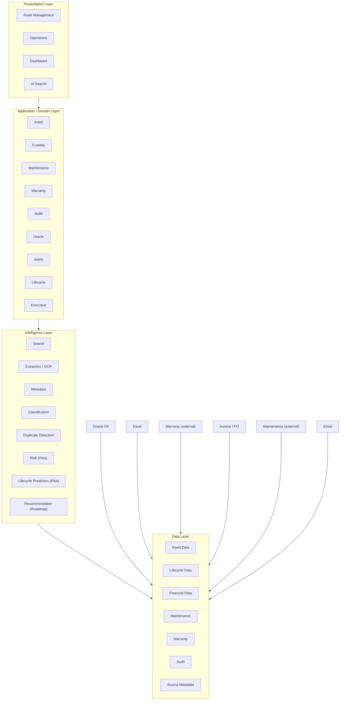

# RAISE Design Document

**Product:** RAISE — Enterprise Asset Intelligence Platform
**Document:** System / Product Design
**Version:** 0.4 Draft
**Status:** Draft for Design Review
**Design Source:** [`RAISE-PRD.md`](../01-requirements/RAISE-PRD.md)
**Source of Truth:** RAISE PRD
**Reference Only:** VERSCAN

---

## 1. Purpose

This document translates the approved / proposed requirements in
`RAISE-PRD.md` into a logical product and system design.

The design answers:

- How RAISE capabilities are organized
- How users interact with the platform
- How asset data flows through the system
- How Oracle FA and other data sources connect
- How the AI Intelligence Layer operates
- Which responsibilities are deterministic and which use AI
- What must be designed further before implementation

This document does **not** invent final technology choices where the PRD
does not define them.

---

# 2. Design Principles

## 2.1 PRD is the Source of Truth

All design decisions must trace back to a RAISE requirement.

```text
RAISE-PRD.md
     ↓
RAISE-DESIGN.md
     ↓
Prototype
     ↓
Acceptance Criteria
     ↓
Test Plan
```

If a design element cannot be traced to a requirement, it must be
classified as:

- Design Support
- Technical Necessity
- Open Question
- Future / Roadmap

---

## 2.2 VERSCAN is Reference Only

VERSCAN may be used to inspect existing Asset Management workflows and
UX patterns.

It must not be used as an automatic source of RAISE functionality.

```text
VERSCAN
   ↓
Reference / Benchmark
   ↓
Candidate Design Pattern
   ↓
Check against RAISE PRD
   ↓
Use only if required / approved
```

---

## 2.3 Deterministic First

Business-critical operations should use deterministic application logic.

Examples:

- CRUD
- Asset state changes
- Check-in / Check-out
- Approval / workflow rules
- Financial data processing
- Audit logging
- Access control

AI should not replace deterministic rules where exact behavior is
required.

---

## 2.4 AI as an Intelligence Layer

AI is positioned as a layer between connected data sources and business
applications.

```text
Data Sources
     ↓
Data Integration / Normalization
     ↓
AI Intelligence Layer
     ↓
Business Applications
```

---

# 3. Logical System Architecture

## 3.1 High-Level Architecture



### Design Note

The diagram is a logical architecture. It does not prescribe a specific
cloud provider, programming language, database, AI model, or deployment
platform because those are not defined in the PRD.

**Traceability note on Intelligence Layer nodes (updated 2026-08-21 against
PRD v0.3):** `I2` (Extraction/OCR), `I8` (Metadata), `I3` (Classification), and
`I4` (Duplicate Detection) reflect the "Current" AI capabilities named in
[`RAISE-PRD.md`](../01-requirements/RAISE-PRD.md#7-ai-requirements) §7's
capability table. As of PRD v0.3 (§16 Resolved Question 28), these four
capabilities now each have a dedicated Traceability ID at Priority P0 / Scope
MVP — `RAISE-AI-DOC-001` (Extraction/OCR, node `I2`), `RAISE-AI-DOC-002`
(Metadata, node `I8`), `RAISE-AI-DOC-003` (Classification, node `I3`), and
`RAISE-AI-DOC-004` (Duplicate Detection, node `I4`) — matching the treatment
already given to Natural Language Search (`RAISE-AI-SEARCH-001`). This
replaces the prior design note stating these nodes had "no dedicated
Traceability ID ... in the PRD"; that gap is now closed at the PRD identity/
priority/scope level. Detailed acceptance behavior for each of the four
remains **TBD** in the PRD itself, so this design likewise does not assume
document scope, field lists, matching thresholds, or resolution workflows —
see [§9A Document Intelligence Capabilities](#9a-document-intelligence-capabilities-ocrextraction-metadata-classification-duplicate-detection)
below for the design-level detail and open items.

---

# 4. Major System Components

## 4.1 Asset Management

Responsible for:

- Asset Registry
- Category & Hierarchy
- Asset lifecycle information
- Asset identity
- Asset status

Requirement traceability:

- `RAISE-FR-ASSET-001`
- `RAISE-FR-ASSET-002`
- `RAISE-FR-LIFE-001`

---

## 4.2 Custody & Asset Operations

Responsible for:

- Custody History
- Check-in / Check-out
- QR / Barcode identification
- Asset state transition

Requirement traceability:

- `RAISE-FR-ASSET-003`
- `RAISE-FR-OPS-001`
- `RAISE-FR-OPS-002`

### Conceptual State

```text
                    ┌──────────────┐
                    │   REGISTERED │
                    └──────┬───────┘
                           │
                           ▼
                    ┌──────────────┐
                    │   ASSIGNED   │
                    └──────┬───────┘
                           │
                    Check-out / Transfer
                           │
                           ▼
                    ┌──────────────┐
                    │   IN USE     │
                    └──────┬───────┘
                           │
                         Return
                           │
                           ▼
                    ┌──────────────┐
                    │   CHECK-IN   │
                    └──────┬───────┘
                           │
                           ▼
                 ┌────────────────────┐
                 │ Maintenance / Audit│
                 └─────────┬──────────┘
                           │
                           ▼
                       Disposal
```

**Important:** Exact asset statuses and transition rules remain TBD in
the PRD.

**Open ambiguity (from PRD Pre-Finalization Quality Pass):** the PRD does not
clarify whether Check-in/Check-out (`RAISE-FR-OPS-002`) is the *only* mechanism
that writes Custody History (`RAISE-FR-ASSET-003`), or whether other events
(e.g., direct reassignment) also do. This design groups both under one domain
component (Custody & Asset Operations) pending that business confirmation — see
[`RAISE-PRD.md`](../01-requirements/RAISE-PRD.md#duplicated--overlapping-requirements).

**Disposal is Enterprise Roadmap, not MVP** (resolved 2026-08-21, see
`RAISE-PRD.md` §14 item 7 and §16 Resolved Questions). It remains in this diagram as the
conceptual terminal stage of the asset lifecycle, but no Disposal screen, flow, or data
model is part of the MVP design — no MVP component in §4/§5/§6 below should be read as
implying a disposal capability exists.

---

# 5. Maintenance & Warranty

## 5.1 Maintenance Domain

The maintenance domain stores maintenance information associated with an
asset.

Conceptual relationship:

```text
Asset
  │
  ├── Maintenance Record
  │       ├── Date
  │       ├── Event
  │       ├── Status
  │       └── Cost
  │
  └── Maintenance History
```

The final field model, SLA, vendor model and cost model are not defined
in the PRD and therefore remain TBD.

Requirement:

`RAISE-FR-MAINT-001`

---

## 5.2 Warranty Domain

```text
Asset
  │
  └── Warranty
       ├── Start
       ├── End
       └── Status
```

The exact warranty fields are TBD.

Requirement:

`RAISE-FR-WARRANTY-001`

### Future AI Use

Warranty information can become an input to:

- Natural-language search
- Risk analysis
- Lifecycle analysis
- Recommendation

---

# 6. Oracle FA Integration

## 6.1 Logical Design

```text
                 ┌─────────────────┐
                 │    Oracle FA    │
                 └────────┬────────┘
                          │
                          │ Integration
                          ▼
                 ┌─────────────────┐
                 │ Integration     │
                 │ Layer           │
                 └────────┬────────┘
                          │
                 Mapping / Validation
                          │
                          ▼
                 ┌─────────────────┐
                 │ RAISE Asset     │
                 │ Data Context    │
                 └────────┬────────┘
                          │
             ┌────────────┼────────────┐
             ▼            ▼            ▼
          Dashboard     Search      Intelligence
```

## 6.2 Required MVP Capability

The PRD requires:

- Oracle FA Integration
- Import NBV / Depreciation

Requirement:

`RAISE-FR-ORACLE-001`

## 6.3 Integration Design Decisions Still Required

The PRD explicitly leaves these open:

- API vs file integration
- Synchronization frequency
- Data mapping
- Error handling
- Retry mechanism
- Integration ownership
- Source-of-truth rules
- Security mechanism

Therefore the design must not prematurely select one method.

---

# 7. Data Source Architecture

RAISE connects information from multiple sources.

```text
┌────────────┐
│   Excel    │
└─────┬──────┘
      │
┌─────▼──────┐
│ Oracle FA  │
└─────┬──────┘
      │
┌─────▼──────┐
│  Warranty  │
└─────┬──────┘
      │
┌─────▼──────┐
│ Maintenance│
└─────┬──────┘
      │
┌─────▼──────┐
│ Invoice/PO │
└─────┬──────┘
      │
┌─────▼──────┐
│   Email    │
└─────┬──────┘
      │
      ▼
Integration / Normalization
      │
      ▼
RAISE Intelligence Context
```

## 7.1 Data Normalization

The integration layer should conceptually perform:

```text
Source Data
   ↓
Extract
   ↓
Validate
   ↓
Map
   ↓
Normalize
   ↓
Associate with Asset
   ↓
Store / Index
   ↓
Expose to Applications / AI
```

The exact implementation is TBD.

---

# 8. AI Intelligence Architecture

## 8.1 Hybrid AI Model

RAISE PRD defines two major execution patterns.

### Deterministic / Rule-based

```text
CRUD
Workflow
Business Rules
Access Control
Audit
Financial Processing
```

### LLM / RAG

```text
Natural Language Search
Data Summarization
```

This separation must be preserved.

---

## 8.2 AI Flow

```text
                    User Question
                          │
                          ▼
                 ┌─────────────────┐
                 │ Query / Intent   │
                 │ Understanding    │
                 └────────┬────────┘
                          │
                          ▼
                 ┌─────────────────┐
                 │ Data Retrieval  │
                 │ / RAG           │
                 └────────┬────────┘
                          │
                          ▼
                 ┌─────────────────┐
                 │ Context / Source│
                 │ Validation      │
                 └────────┬────────┘
                          │
                          ▼
                 ┌─────────────────┐
                 │ LLM / Response  │
                 └────────┬────────┘
                          │
                          ▼
                    User Answer
```

### Important Design Rule

The AI response must not invent asset facts.

Where applicable, the response should expose the source information used
to produce the answer.

The exact citation / provenance mechanism remains a design item because
the PRD asks how AI answers should cite source data.

---

# 9. Natural Language Search

Requirement:

`RAISE-AI-SEARCH-001`

## Conceptual Flow

```text
User
 │
 │ "Which notebooks expire
 │  within 90 days?"
 ▼
AI Search
 │
 ▼
Identify intent
 │
 ▼
Retrieve:
 ├── Asset
 ├── Warranty
 ├── Maintenance
 └── Financial data
 │
 ▼
Apply business rules / filters
 │
 ▼
Generate answer
 │
 ▼
Show result + source context
```

The final UI and retrieval technology are TBD.

**Open ambiguity (from PRD Pre-Finalization Quality Pass):** the PRD classifies
Natural Language Search as a "Current" AI capability and lists it as `P0`, but
it is unclear whether "Current" means already prototyped/demoed at the pitch or
simply "intended for MVP." This design treats `RAISE-AI-SEARCH-001` as MVP based
on that classification, consistent with the PRD's own reading — but this should
be confirmed, not assumed settled, before implementation. See
[`RAISE-PRD.md`](../01-requirements/RAISE-PRD.md#ambiguous-requirements).

---

# 9A. Document Intelligence Capabilities (OCR/Extraction, Metadata, Classification, Duplicate Detection)

Requirements:

- `RAISE-AI-DOC-001` (OCR / Extraction)
- `RAISE-AI-DOC-002` (Metadata)
- `RAISE-AI-DOC-003` (Classification)
- `RAISE-AI-DOC-004` (Duplicate Detection)

Status: **Current AI capability, Priority P0, Scope MVP** (confirmed
2026-08-21 via PRD §16 Resolved Question 28). These four capabilities were
previously row labels only in the PRD §7 capability table with no dedicated
requirement; they now have Traceability IDs and MVP scope, consistent with
`RAISE-AI-SEARCH-001`.

## Conceptual Flow

```text
Source Document / Record
 (Invoice, PO, Warranty doc,
  Maintenance doc, Email attachment)
        │
        ▼
 OCR / Extraction (RAISE-AI-DOC-001)
        │
        ▼
 Metadata Generation (RAISE-AI-DOC-002)
        │
        ▼
 Classification (RAISE-AI-DOC-003)
        │
        ▼
 Duplicate Detection (RAISE-AI-DOC-004)
        │
        ▼
 Associate with Asset / Financial / Maintenance / Warranty record
```

This sequencing (Extraction → Metadata → Classification → Duplicate
Detection) is a **design-level convenience grouping only** — the PRD does not
state an execution order between the four capabilities, and each may in
practice run independently or in a different order. This diagram should not
be read as a specified pipeline.

## Design Notes and TBD Items

Per PRD §7 (`RAISE-AI-DOC-001` through `RAISE-AI-DOC-004`), each capability's
acceptance criteria states only that detailed behavior is **TBD**. This
design therefore leaves the following as open design items rather than
inventing values:

- **OCR / Extraction (`RAISE-AI-DOC-001`):** which document types are in
  scope, which fields are extracted, and the accuracy threshold are TBD.
- **Metadata (`RAISE-AI-DOC-002`):** which metadata fields/tags are generated
  and how they are surfaced to users are TBD.
- **Classification (`RAISE-AI-DOC-003`):** whether this capability assigns
  category values directly into `RAISE-FR-ASSET-002` (Category & Hierarchy)
  or only suggests them for human confirmation is TBD.
- **Duplicate Detection (`RAISE-AI-DOC-004`):** matching criteria/threshold
  and the resolution workflow (auto-merge vs. flag-for-review) are TBD.

## Hybrid AI Architecture Placement

Consistent with [§2.3 Deterministic First](#23-deterministic-first) and
[§8.1 Hybrid AI Model](#81-hybrid-ai-model): these four capabilities sit in
the AI/LLM-assisted layer (they are listed as "Current" AI capabilities in
PRD §7, not as deterministic CRUD), but any action with business-record
impact — e.g., auto-assigning a category, or auto-merging a duplicate asset
record — must not bypass deterministic confirmation/audit logic until the
PRD defines whether these outputs are auto-applied or human-reviewed (see TBD
items above). This boundary must be preserved regardless of which capability
runs first.

## Dependencies

- `RAISE-FR-ASSET-001` (all four)
- `RAISE-FR-ASSET-002` (Classification, `RAISE-AI-DOC-003`)
- `RAISE-AI-DOC-001` (Metadata, `RAISE-AI-DOC-002`, depends on extraction
  output per PRD)
- Data sources named in PRD §7 intro: Excel, Oracle FA, Warranty,
  Maintenance, Invoice/PO, Email

---

# 10. Risk Scoring

Requirement:

`RAISE-AI-RISK-001`

Status:

**Pilot**

## Conceptual Input

```text
Asset Age
    │
Maintenance History
    │
Warranty Status
    │
Oracle FA
    │
    ▼
Risk Evaluation
    │
    ▼
Risk Score
```

The PRD does not define:

- Formula
- Weight
- Threshold
- Training data
- Model
- Accuracy target

Therefore these must be validated as part of the pilot design.

---

# 11. Lifecycle Prediction

Requirement:

`RAISE-AI-LIFECYCLE-001`

Status:

**Pilot**

Concept:

```text
Historical Asset Data
        │
        ├── Age
        ├── Maintenance
        ├── Warranty
        ├── Financial
        └── Lifecycle
        │
        ▼
Prediction Model
        │
        ▼
Future Lifecycle Signal
```

Prediction target and accuracy criteria are TBD.

---

# 12. AI Recommendation

Requirement:

`RAISE-AI-RECOMMEND-001`

Status:

**Roadmap**

The design should leave an extension point for future recommendations.

Concept:

```text
Connected Data
      │
      ▼
Risk / Prediction
      │
      ▼
Business Rules
      │
      ▼
Recommendation
      │
      ├── Recommended Action
      ├── Reason
      ├── Confidence
      └── Source References
```

This capability must not be treated as mandatory Phase 1 implementation
based on the current PRD.

---

# 13. Executive Intelligence

Requirement:

`RAISE-FR-EXEC-001`

## Logical Dashboard

```text
┌────────────────────────────────────────────────┐
│              Executive Dashboard              │
├────────────┬────────────┬──────────────────────┤
│    NBV     │    Risk    │     Utilization      │
├────────────┴────────────┴──────────────────────┤
│ Asset Overview                                 │
│                                                │
│ Category / Lifecycle / Financial Overview      │
│                                                │
├────────────────────────────────────────────────┤
│ Executive Summary                              │
└────────────────────────────────────────────────┘
```

The PRD identifies:

- NBV
- Risk
- Utilization

as proposal-defined KPIs.

NBV and Risk KPI formulas, thresholds, and dashboard layout remain TBD — see
[`RAISE-PRD.md`](../01-requirements/RAISE-PRD.md#16-open-questions) §16 Q3
(partially resolved).

**Utilization — Resolved 2026-08-21 (PRD v0.3, §16 Resolved Question 27):**
~~"Utilization" is listed in the PRD as a KPI with no definition~~. Business
confirmed the definition as **assignment-time-based**:

> Utilization = % of time an asset is assigned to a user/department,
> relative to total available time.

The Utilization tile in the dashboard mockup above should be read against
this definition. This design does **not** yet specify the calculation
mechanics (e.g., how "assigned" state/time is measured against the Custody
domain in [§4.2](#42-custody--asset-operations), what "total available time"
excludes, or the aggregation window/granularity) — those remain design-phase
items, but the *conceptual* definition itself is no longer ambiguous. NBV and
Risk KPI formulas remain undefined and unresolved. See
[`RAISE-PRD.md`](../01-requirements/RAISE-PRD.md#8-executive-intelligence) §8
and [`RAISE-PRD.md`](../01-requirements/RAISE-PRD.md#ambiguous-requirements)
Pre-Finalization Quality Pass.

**Open ambiguity (from PRD Pre-Finalization Quality Pass):** the "Executive
Summary" block above corresponds to the PRD's "AI-Generated Executive Summary"
under `RAISE-FR-EXEC-001`. The PRD describes it as a demonstrated capability but
does **not** state whether it is MVP or Roadmap — its dependency on
natural-language summarization sits at the boundary of what is explicitly
"Current" AI capability. This design includes the block as a placeholder only;
it must not be read as confirmed MVP scope until resolved. See
[`RAISE-PRD.md`](../01-requirements/RAISE-PRD.md#gaps-between-hackathon-proposal-and-proposed-prd).

---

# 14. Alert Architecture

Requirement:

`RAISE-FR-ALERT-001`

## MVP

The system needs an alert capability.

```text
Business Event
     │
     ▼
Rule Evaluation
     │
     ▼
Alert Created
     │
     ▼
Authorized User
```

Exact MVP alert rules and channels are TBD.

## Roadmap

Multi-channel delivery:

```text
Email
Teams
LINE Notify
```

is Phase 2 / Enterprise Roadmap.

**Design boundary note (from PRD Pre-Finalization Quality Pass):** the
warranty-expiry-within-90-days scenario is used in the PRD to illustrate *both*
this MVP Alert capability (`RAISE-FR-ALERT-001`) and the Roadmap AI
Recommendation capability (`RAISE-AI-RECOMMEND-001`). These are not the same
requirement — MVP Alert scope must stay a simple rule-triggered notification
and must not be over-built to match the richer Roadmap recommendation example
(recommended action, confidence, reason, source references). See
[`RAISE-PRD.md`](../01-requirements/RAISE-PRD.md#duplicated--overlapping-requirements).

---

# 15. Audit Architecture

Requirement:

`RAISE-FR-AUDIT-001`

## Concept

```text
User / System Action
        │
        ▼
Audit Event
        │
        ▼
Immutable Audit Store
        │
        ▼
Audit Review
```

Audit events should conceptually contain enough information to support
traceability.

Potential attributes requiring confirmation:

- Actor
- Timestamp
- Action
- Entity
- Before / After
- Source
- Result

These are design candidates, not finalized PRD requirements.

The PRD still requires definition of:

- Retention
- Storage architecture
- Event taxonomy
- Privileged administrator controls

---

# 16. Security Architecture

The PRD requires a later Security Design.

Logical model:

```text
User
 │
 ▼
Authentication
 │
 ▼
Authorization / RBAC
 │
 ▼
Application
 │
 ├── Asset Data
 ├── Financial Data
 ├── Maintenance
 ├── Warranty
 ├── AI
 └── Audit
```

## Security Design Work Items

- Authentication mechanism
- Authorization model
- Role definitions
- Data access boundaries
- AI data access control
- Sensitive data handling
- Integration credentials
- Administrative access

No specific technology is selected by this design.

---

# 17. Primary User Interaction Model

## IT Asset

```text
Login
 ↓
Asset Registry
 ↓
Search / Scan
 ↓
View / Update Asset
 ↓
Custody / Maintenance / Warranty
 ↓
Audit
```

## Finance

```text
Login
 ↓
Financial Asset View
 ↓
Oracle FA Data
 ↓
NBV / Depreciation
 ↓
Reconciliation / Analysis
```

## Executive

```text
Login
 ↓
Executive Dashboard
 ↓
KPI
 ↓
Asset Insight
 ↓
Summary
```

## Auditor

```text
Login
 ↓
Asset / History
 ↓
Custody History
 ↓
Audit Log
 ↓
Traceability
```

These are logical journeys derived from the PRD user groups and
requirements. Detailed UX is deferred to Prototype.

---

# 18. Logical Data Model

The PRD does not define a final database schema. The following is a
conceptual model for design discussion.

```text
                    ┌──────────────┐
                    │    ASSET     │
                    └──────┬───────┘
                           │
       ┌───────────────────┼────────────────────┐
       │                   │                    │
       ▼                   ▼                    ▼
  CATEGORY             CUSTODY              WARRANTY
                           │
                           ▼
                      MAINTENANCE

       ASSET
         │
         ├────────────── FINANCIAL
         │                 │
         │                 └── NBV / Depreciation
         │
         ├────────────── QR / BARCODE
         │
         └────────────── LIFECYCLE

All significant system activities
         │
         ▼
    AUDIT LOG
```

## Data Model TBD

The following require detailed design:

- Asset master fields
- Category hierarchy
- Holder model
- Maintenance fields
- Warranty fields
- Financial fields
- Oracle mapping
- Lifecycle state model
- Audit event model

---

# 19. API / Integration Boundary

The design should maintain clear boundaries between domains.

```text
                 ┌──────────────────┐
                 │ Presentation     │
                 └────────┬─────────┘
                          │
                    Application APIs
                          │
        ┌─────────────────┼──────────────────┐
        ▼                 ▼                  ▼
     Asset API       Operations API      AI API
        │                 │                  │
        ▼                 ▼                  ▼
     Asset Data       Lifecycle         Intelligence
                                            │
                                     Data Retrieval
                                            │
                              ┌─────────────┼─────────────┐
                              ▼             ▼             ▼
                           Oracle         Internal      External
                           / Sources      Data          Sources
```

The exact API style, authentication and endpoint definitions are TBD.

---

# 20. Error Handling Principles

Because integration and AI depend on external / connected data, the
system should distinguish:

```text
SUCCESS
PARTIAL_SUCCESS
VALIDATION_ERROR
SOURCE_UNAVAILABLE
INTEGRATION_ERROR
AUTHORIZATION_ERROR
AI_UNABLE_TO_ANSWER
DATA_CONFLICT
```

These are proposed design states and must be validated before
implementation.

---

# 21. Data Conflict Handling

The PRD explicitly asks:

> What happens when source data conflicts?

Therefore the design requires a source-of-truth policy before
implementation.

Conceptual flow:

```text
Source A ──┐
           │
Source B ──┼──► Conflict Detection
           │
Source C ──┘
                  │
                  ▼
             Resolution Rule
                  │
            ┌─────┴─────┐
            ▼           ▼
        Resolved     Escalate
```

The actual source priority rules are TBD.

---

# 22. MVP vs Roadmap Design Boundary

## MVP

```text
Asset Registry
Category / Hierarchy
Custody History
QR / Barcode
Check-in / Check-out
Maintenance
Warranty
Oracle FA Integration
NBV / Depreciation
Alerts
Immutable Audit Log
```

## Current / AI Capability Classification

```text
OCR / Extraction
Metadata
Classification
Duplicate Detection
Natural Language Search
```

## Pilot

```text
Risk Scoring
Lifecycle Prediction
```

## Roadmap

```text
AI Recommendation
Real-time ERP Integration
Native Mobile App
Predictive Analytics
Workflow Automation
Multi-channel Alerts
Asset Disposal Workflow
```

**Asset Disposal Workflow** was confirmed as Enterprise Roadmap (not MVP) by
Product/Business decision on 2026-08-21 (see [`RAISE-PRD.md`](../01-requirements/RAISE-PRD.md)
§14 item 7 and §16 Resolved Questions, item 26). It remains the conceptual terminal stage
of the asset lifecycle diagram in [§4.2](#42-custody--asset-operations), but no MVP
component in §4–§6 implies a working disposal capability.

The classification must remain aligned with the PRD until Product Review
changes it.

---

# 23. Prototype Preparation

The next Prototype should be derived from this design and the PRD.

Recommended initial screen groups:

```text
1. Login / Access
2. Asset Dashboard
3. Asset Registry
4. Asset Detail
5. QR / Barcode Operation
6. Check-in / Check-out
7. Maintenance
8. Warranty
9. Oracle / Financial Asset View
10. Audit History
11. Executive Dashboard
12. AI Natural Language Search
```

### Important

The screen list is a **prototype planning proposal**, not an approved UI
requirement.

Each screen must be traced to one or more PRD requirements before being
treated as mandatory.

---

# 24. Design Traceability

| PRD Requirement | Design Area |
|---|---|
| RAISE-FR-ASSET-001 | Asset Management |
| RAISE-FR-ASSET-002 | Category / Hierarchy |
| RAISE-FR-ASSET-003 | Custody |
| RAISE-FR-OPS-001 | QR / Barcode |
| RAISE-FR-OPS-002 | Check-in / Check-out |
| RAISE-FR-MAINT-001 | Maintenance |
| RAISE-FR-WARRANTY-001 | Warranty |
| RAISE-FR-ORACLE-001 | Oracle Integration |
| RAISE-FR-ALERT-001 | Alert Architecture |
| RAISE-FR-AUDIT-001 | Audit Architecture |
| RAISE-FR-EXEC-001 | Executive Dashboard |
| RAISE-FR-LIFE-001 | Lifecycle |
| RAISE-AI-SEARCH-001 | AI Search |
| RAISE-AI-DOC-001 | Document Intelligence Capabilities (§9A) |
| RAISE-AI-DOC-002 | Document Intelligence Capabilities (§9A) |
| RAISE-AI-DOC-003 | Document Intelligence Capabilities (§9A) |
| RAISE-AI-DOC-004 | Document Intelligence Capabilities (§9A) |
| RAISE-AI-RISK-001 | Risk Scoring |
| RAISE-AI-LIFECYCLE-001 | Lifecycle Prediction |
| RAISE-AI-RECOMMEND-001 | Recommendation Extension |

**Cross-check against [`RAISE-PRD.md`](../01-requirements/RAISE-PRD.md) §17 (Requirement
Traceability Matrix, PRD v0.3):** every PRD requirement ID has a corresponding design
area above, including the four new `RAISE-AI-DOC-001`–`RAISE-AI-DOC-004` rows added
2026-08-21 to match PRD v0.3 §16 Resolved Question 28. One PRD item,
`RAISE-NFR-SEC-RBAC-001`, is intentionally not a row here because it is covered
structurally by [§16 Security Architecture](#16-security-architecture) rather than a
single design area — no gap, just a different mapping shape.

---

# 25. Design Open Questions

These must be resolved before implementation. (Superset of PRD §16, restated in
design-relevant grouping — not a new set of questions.)

## Business

1. What is the authoritative asset master?
2. Which asset types are in MVP?
3. What is utilization? — **Partially resolved 2026-08-21** (PRD v0.3 §16
   Resolved Question 27): definition confirmed as assignment-time-based (see
   [§13 Executive Intelligence](#13-executive-intelligence)). Calculation
   mechanics, aggregation window, and NBV/Risk KPI formulas remain open.
4. What is risk?
5. What business decision should AI support first?

## Data

6. What is the asset master schema?
7. What is the category hierarchy?
8. What is the holder model?
9. What fields are required for maintenance?
10. What fields are required for warranty?

## Oracle

11. Oracle FA version/system?
12. Required fields?
13. Source of truth for financial data?
14. Synchronization frequency?
15. Integration method?

## AI

16. Which AI capabilities are mandatory for the Hackathon implementation?
17. Which sources can AI access?
18. How are source citations shown?
19. What confidence threshold is acceptable?
20. How are conflicting sources handled?

## Security

21. Authentication mechanism?
22. Roles and permissions?
23. Sensitive data?
24. Immutable audit event definition?
25. Retention period?

---

# 26. Technology Selection

The PRD does **not** define a final technology stack.

Therefore this design intentionally does not select:

- Frontend framework
- Backend framework
- Database technology
- Cloud provider
- AI model
- Vector database
- Integration middleware
- Messaging platform
- Deployment platform

These should be selected after:

1. Functional design
2. Data model
3. Integration requirements
4. Security requirements
5. AI evaluation requirements

Technology choices must support the PRD rather than redefine it.

---

# 27. Design Review Gate

Before moving to Prototype, confirm:

- [ ] Every MVP requirement has a design representation
- [ ] No VERSCAN feature was added without RAISE requirement support
- [ ] Oracle integration boundary is defined enough for prototype
- [ ] Asset lifecycle model is accepted
- [ ] User journeys are accepted
- [ ] AI / deterministic boundary is accepted
- [ ] Security design work items are identified
- [ ] Data model open questions are tracked
- [ ] Roadmap capabilities are not accidentally included in MVP
- [ ] Design traceability is complete

---

# 28. Next Deliverable

After Design Review:

```text
RAISE-PRD.md
      ↓
RAISE-DESIGN.md       ← Current
      ↓
RAISE-PROTOTYPE
      ↓
RAISE-ACCEPTANCE-CRITERIA.md
      ↓
RAISE-TEST-PLAN.md
      ↓
RAISE-TEST-CASES.md
      ↓
RAISE-TRACEABILITY-MATRIX.md
      ↓
Development
      ↓
RAISE-COMPLIANCE-REVIEW.md
```

---

## Document Status

**Version:** 0.4 (re-synced against RAISE-PRD.md v0.3, 2026-08-21, via
`/sync-design` session)

**Change Log — v0.3 → v0.4 (sync with PRD v0.2 → v0.3):**

1. **Four new AI requirement IDs bound to design.** PRD v0.3 (§16 Resolved
   Question 28) added `RAISE-AI-DOC-001` (OCR/Extraction), `RAISE-AI-DOC-002`
   (Metadata), `RAISE-AI-DOC-003` (Classification), and `RAISE-AI-DOC-004`
   (Duplicate Detection) at Priority P0 / Scope MVP. This design now: (a)
   updates the §3.1 Intelligence Layer traceability note to bind nodes `I2`,
   `I8`, `I3`, `I4` to these IDs instead of stating "no dedicated
   Traceability ID"; (b) adds new [§9A Document Intelligence
   Capabilities](#9a-document-intelligence-capabilities-ocrextraction-metadata-classification-duplicate-detection)
   describing conceptual flow, TBD acceptance items (carried forward unchanged
   from the PRD, not invented), and Hybrid AI Architecture placement; (c)
   adds four rows to the §24 Design Traceability table.
2. **Utilization KPI callout changed from "Open ambiguity" to "Resolved."**
   PRD v0.3 (§16 Resolved Question 27) confirmed Utilization as
   assignment-time-based (% of time an asset is assigned to a
   user/department, relative to total available time). §13 Executive
   Intelligence and §25 Design Open Questions (Q3) updated accordingly.
   Calculation mechanics, aggregation window, and NBV/Risk KPI formulas
   remain open design items — not silently resolved.
3. No other requirement gaps, stale requirement references, or AI status
   mismatches were found against PRD v0.3 §7/§8/§17. All 21 Traceability
   IDs in PRD §17 (v0.3) now have a corresponding design area in §24.

**Status:** Draft for Design Review
**Source:** [`RAISE-PRD.md`](../01-requirements/RAISE-PRD.md) v0.3
**Next Action:** Review and approve logical design before Prototype; note
that downstream documents (`RAISE-PROTOTYPE.md`,
`RAISE-ACCEPTANCE-CRITERIA.md`, `RAISE-TEST-PLAN.md`, `RAISE-TEST-CASES.md`,
`RAISE-TRACEABILITY-MATRIX.md`) still need their own sync pass to reflect
`RAISE-AI-DOC-001`–`RAISE-AI-DOC-004` and the resolved Utilization
definition, per PRD v0.3 Document Status §4.
