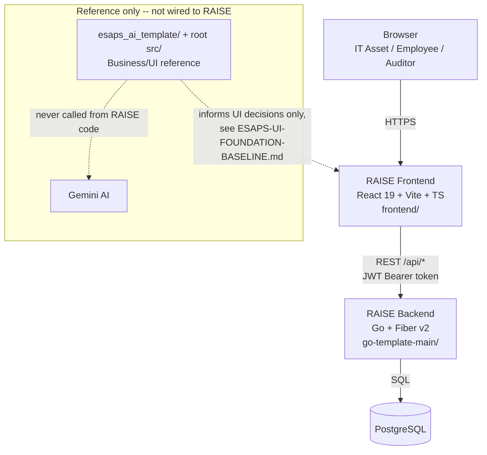
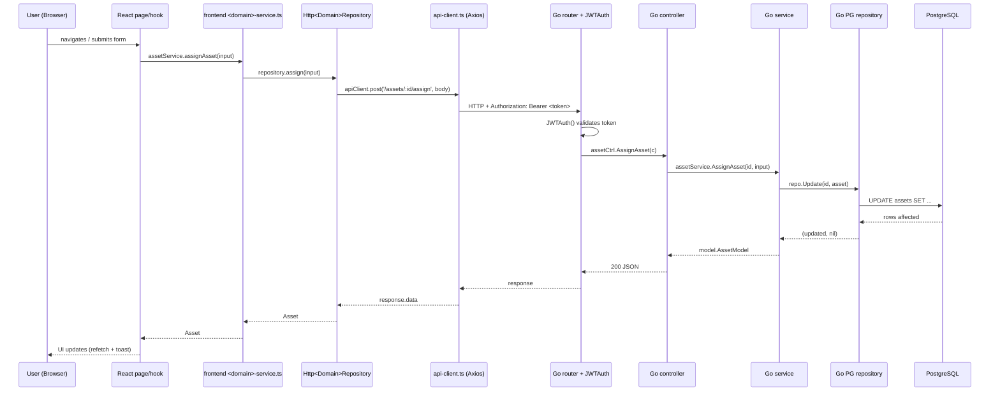

# RAISE — High-Level Architecture

**Document Status:** Draft for Review
**Scope note:** this documents the **as-built** system architecture of the
code that actually exists in this repository today (`go-template-main/` +
`frontend/`), after the 7-stage deliverable chain
(`docs/01-requirements/` … `docs/07-traceability-matrix/`) and after real
backend/frontend development began (Asset, Employee, Maintenance/Ticket
domains — see [`docs/project-management/RAISE-PROJECT-TIMELINE.md`](../project-management/RAISE-PROJECT-TIMELINE.md)).
It is **not** a numbered stage of the deliverable chain and carries no
`RAISE-FR-*`/`RAISE-AI-*`/`RAISE-NFR-*` ID of its own — it cites existing IDs
from [`RAISE-PRD.md`](../01-requirements/RAISE-PRD.md) and
[`RAISE-DESIGN.md`](../02-design/RAISE-DESIGN.md) where relevant. Where the
architecture is genuinely undecided (hosting, CI/CD, observability), this is
marked **TBD** rather than invented — see §6.

---

## 1. System Context



`esaps_ai_template/`, root `src/`, and Gemini are **reference-only** per
[`CLAUDE.md`](../../CLAUDE.md) — they inform which UI patterns to
keep/extend/replace, but no RAISE code imports or calls them. The frontend
never calls an AI provider directly (see [`RAISE-DESIGN.md`](../02-design/RAISE-DESIGN.md)
AI architecture section) — `RAISE-AI-*` capabilities, where built, go through
the backend.

## 2. Component Overview

### 2.1 Frontend (`frontend/`, package name `raise-frontend`)

- **Stack:** React 19, Vite 6, TypeScript ~5.8, Tailwind CSS v4, React Router 7, Axios, Vitest + Testing Library.
- **Structure:** `pages/` (one folder per screen, matching [`RAISE-PROTOTYPE.md`](../03-prototype/RAISE-PROTOTYPE.md)'s screen inventory) → `hooks/` (one `use<Domain>`/`use<Domain>s` pair per domain, thin data-fetching wrappers) → `services/` (one `<domain>-service.ts` per domain — the stable contract every page depends on) → `services/<domain>-repository.ts` (the swappable implementation layer).
- **Repository swap pattern:** every domain repository has a `Mock<Domain>Repository` (in-memory, seeded from `data/fixtures/`) and, once a real backend endpoint exists, an `Http<Domain>Repository` (calls `api-client.ts`). Which one is active is controlled by a per-domain feature flag in `config/featureFlags.ts` (`ASSET_API_ENABLED`, `EMPLOYEE_API_ENABLED`, `TICKET_API_ENABLED`), read from `VITE_*_API_ENABLED` env vars, **default `false`**. This lets the whole existing test suite and local dev run without any backend/Postgres, while individual domains can be switched to the real API independently as they're built.
- **Single API boundary:** `services/api-client.ts` is the only place that constructs HTTP requests to the backend — an Axios instance with a request interceptor that attaches `Authorization: Bearer <token>` from `localStorage`, and a response interceptor that clears the session and redirects to `/login` on `401`.

### 2.2 Backend (`go-template-main/`)

- **Stack:** Go, Fiber v2 (HTTP framework), PostgreSQL (`database/sql` + the template's own PG pool), JWT (`golang-jwt`), Viper (config/env).
- **Layered architecture per domain**, consistent across Asset/Employee/Ticket:

  ```
  router/sampleRouter.go  (route -> handler wiring, JWTAuth() middleware gate)
          |
          v
  controller/<domain>Controller.go   (HTTP request/response, status codes, error mapping)
          |
          v
  service/<domain>Service.go         (business rules, defaulting, state transitions)
          |
          v
  repository/<domain>Repository.go   (thin facade interface)
          |
          v
  repository/<domain>PGRepository.go (raw SQL against PostgreSQL)
  ```

  This mirrors the company Go template's convention (see
  [`docs/go-template-analysis/`](../go-template-analysis/)) but **PostgreSQL-only**
  for every real RAISE domain — the template's demo `sample` domain fans out
  to TT/PG/Oracle/MSSQL, which is explicitly demo scaffolding, not a pattern
  real domains repeat (see `AssetRepository`'s own doc comment).
- **Cross-cutting middleware** (`main.go`): CORS (env-configured allow-list,
  default `localhost:3000`/`localhost:5173`), a custom audit-style access log
  (`[AUDIT] time | trace_id | ip | user | role | status | latency | method path`),
  and per-route `JWTAuth()` gating everything under `/api` except
  `POST /auth/login`.
- **Auth:** `AuthService` is a **hardcoded single demo user** (`admin`/`password`
  by default, overridable via `AUTH_DEMO_*` env vars) — there is no real user
  store. This is a known template limitation, not a RAISE-specific gap; see §6.

### 2.3 Domains implemented so far

| Domain | Requirement | Layers | Storage shape |
|---|---|---|---|
| Asset Registry (+ Assign/Check-in) | `RAISE-FR-ASSET-001`, `RAISE-FR-ASSET-003` (partial), `RAISE-FR-OPS-002` (partial) | Full stack | Flat relational table (`assets`) |
| Employee | supports `RAISE-FR-ASSET-003` | Full stack | Flat relational table (`employees`) |
| Maintenance / Ticket | `RAISE-FR-MAINT-001` | Full stack | Single JSONB document per row (`tickets.doc`) + denormalized filter columns |

See [`RAISE-API-DB-SPEC.md`](../09-api-db-spec/RAISE-API-DB-SPEC.md) for the
full endpoint/schema detail and [`RAISE-DETAILED-DESIGN.md`](../10-detailed-design/RAISE-DETAILED-DESIGN.md)
for per-domain business logic.

## 3. Request Flow (typical read + write)



## 4. Multi-Engine / Data Access Note

`go-template-main` ships pooled connections for TT, PostgreSQL, Oracle, and
MS SQL (`repository.InitTT`, `InitPG`, `InitOraclePoolWithOptions`,
`InitMSSQLPool` in `main.go`) because the template's demo `sample` domain
fans out across all four. **RAISE domains do not use this fan-out** — Asset,
Employee, and Ticket are PostgreSQL-only by deliberate convention (see
[`COMPANY-FOUNDATION-BASELINE.md`](../company-foundation-baseline/COMPANY-FOUNDATION-BASELINE.md)
§1). The Oracle pool exists in the process only because `RAISE-FR-ORACLE-001`
(Oracle FA Integration) is a confirmed MVP requirement whose *integration
method* is still TBD (PRD §16 Q6–Q10) — no RAISE code talks to it yet.

## 5. Frontend/Backend Contract Conventions

- **Base path:** unversioned `/api` (`router/sampleRouter.go` mounts
  `api := app.Group("/api")`) — `frontend/.env.example`'s
  `VITE_API_BASE_URL` matches this. `/api/v1` versioning is a **named open
  decision** (`COMPANY-FOUNDATION-BASELINE.md` §5.1), not yet made.
- **Field-name parity:** every Go domain model's JSON tags are written to
  match the frontend's TypeScript type field-for-field (e.g.
  `AssetModel.WarrantyExpiry` → `warrantyExpiry`), so `Http<Domain>Repository`
  needs no mapping/translation layer. This is a deliberate convention, not
  an accident — see each model file's doc comment.
- **List envelope:** `{ data: T[], total: number }` for every domain — not
  the template's demo `sample` domain envelope
  (`{data,total,page,limit,total_pages}`), because no RAISE list page has
  server-side pagination wired into its UI yet.
- **Error shape:** `{ message: string, error?: string }` JSON body with a
  matching HTTP status (`400` bad input, `404` not found, `500` unexpected).
  Frontend repositories special-case `404` → `null` (matching each
  `MockRepository`'s not-found behavior) and let other errors propagate.

## 6. Explicitly TBD / Not Decided

Per this project's "flag gaps, don't silently invent" convention (see
[`CLAUDE.md`](../../CLAUDE.md) and every prior sync PR), the following are
**not architectural decisions this document makes** — they remain open:

| Area | Status |
|---|---|
| Hosting / deployment target (cloud provider, containers, IaC) | Not decided anywhere in the PRD or this repo |
| CI/CD pipeline | Not decided — no `.github/workflows/` or equivalent exists for either `frontend/` or `go-template-main/` |
| API versioning (`/api` vs `/api/v1`) | Open, per `COMPANY-FOUNDATION-BASELINE.md` §5.1 |
| Real user/auth store (replacing the hardcoded demo user) | Confirmed **Roadmap**, not MVP, per PRD §16 Resolved Question 38 |
| RBAC backend enforcement (`middleware.RequireRole` beyond the demo `/samples` wiring) | Confirmed **Roadmap**, not MVP — same PRD resolution |
| Observability / monitoring / logging retention | PRD §10 NFR backlog — TBD at every layer, see `RAISE-DESIGN.md` §16A |
| Database migration tooling (the `sql/pg/V*__*.sql` files are applied manually today) | Not decided |
| Scalability / availability targets | PRD §10 NFR backlog — TBD |

Do not resolve any of the above by implication elsewhere in this document —
if new information arrives, update this table explicitly.
