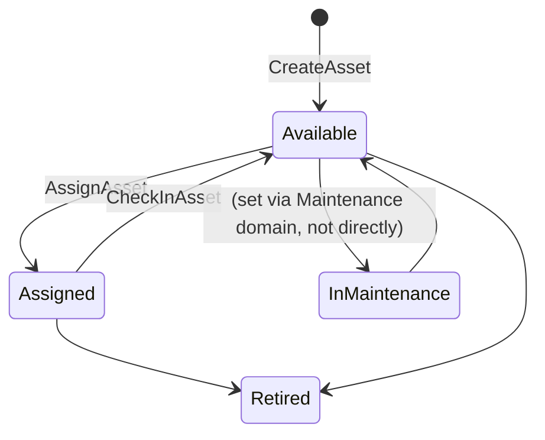
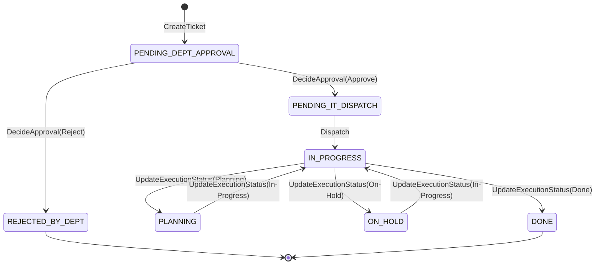
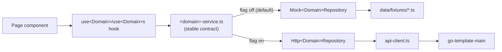

# RAISE — Detailed Design

**Document Status:** Draft for Review
**Scope note:** documents the **as-built** component-level design of
`go-template-main/` and `frontend/` — business logic, state transitions,
error handling, and test strategy for each domain that actually exists
today. Not a numbered stage of the deliverable chain; complements
[`RAISE-HIGH-LEVEL-ARCHITECTURE.md`](../08-architecture/RAISE-HIGH-LEVEL-ARCHITECTURE.md)
(system-level view) and
[`RAISE-API-DB-SPEC.md`](../09-api-db-spec/RAISE-API-DB-SPEC.md)
(wire contracts). Where a business rule is still TBD in the PRD, this
document states that explicitly rather than filling it in.

---

## 1. Design Convention: Mirror the Mock, Then Swap It

Every domain built so far (Asset, Employee, Ticket) followed the same
sequence, and any new domain should too:

1. **Read the frontend's `Mock<Domain>Repository`** (already-approved
   business logic, since it's been running in the app since the Prototype
   phase) and the domain's page components — not just the TypeScript
   interfaces — to capture every conditional branch (e.g. `MockTicketRepository.dispatch`'s
   technician-not-found fallback, `updateExecutionStatus`'s
   conditional resolution-field writes).
2. **Port that exact logic to Go** (`model` → `repository` facade + PG impl
   → `service` → `controller`), with JSON field names matching the frontend
   type field-for-field so no mapping layer is needed.
3. **Add mocked unit tests** at the service layer, using an in-memory
   `map`-backed fake repository (`mock<Domain>Repository` in
   `service/<domain>Service_test.go`) — no live DB required. This was
   flagged as a gap in the company template itself
   (`COMPANY-FOUNDATION-BASELINE.md` §5.5: every existing template test
   depended on a live DB); every RAISE domain closes it.
4. **Wire the frontend's `Http<Domain>Repository`** behind a feature flag,
   default off, so the existing mock-based test suite and local dev keep
   working unchanged.
5. **Deliberately scope out** anything not covered by a confirmed
   Acceptance Criterion — flag it in a doc comment and the PR body, don't
   silently build it or silently drop it.

## 2. Asset Domain

### 2.1 Business logic (`service/assetService.go`)

- `CreateAsset`: generates `id` (UUID) and, if not supplied, `code` in the
  form `AST-<8-char-uuid-fragment>` — **not** the mock's sequential
  `AST-0001`-style code, because sequential-by-list-length isn't meaningful
  once assets can be deleted or the list is paginated server-side (a
  deliberate deviation from the mock, documented in the service's own
  comment). `status` always starts `Available`; `currentValue` defaults to
  `purchaseCost`.
- `AssignAsset`: sets `status=Assigned`, stamps `assignedTo`/
  `assignedEmployeeId`/`assignedDate=today`. Matches
  `MockAssetRepository.assign` exactly.
- `CheckInAsset`: the confirmed, symmetric inverse of `AssignAsset` — clears
  all three custody fields, sets `status=Available`. Added for
  `RAISE-FR-OPS-002`; **no approval step, no permission gate beyond
  `JWTAuth`, no persisted history** because PRD §16 Q11–Q13 (exact workflow,
  who may assign/transfer, holder data model) are still open. Only the
  confirmed state transition is implemented.

### 2.2 State model

`In Maintenance`/`Retired` transitions have no dedicated Asset-domain
endpoint yet — `In Maintenance` is currently only ever set by seed data, not
by any write path (the Maintenance/Ticket domain tracks its own status
independently and does not yet write back to `Asset.status`; this coupling
is not part of the confirmed AC set and is not implemented).

### 2.3 Error handling

`ErrAssetNotFound` (sentinel) → controller maps to `404`. All other repo/service
errors → `500` with the underlying error message in the response body
(acceptable for a pre-production template; not hardened against leaking
internal detail — see §6).

## 3. Employee Domain

- `UpdateEmployee`'s request type (`UpdateEmployeeRequest`) uses `*string`
  for every field specifically so the service can tell "field omitted" from
  "field explicitly cleared" — matching `MockEmployeeRepository.update`'s
  `input.field ?? existing.field` merge semantics. This is the only domain
  with this nullable-pointer merge pattern; Asset/Ticket updates always
  replace the whole record.
- Dual lookup by `id` OR `employeeCode` (`GetByID`, matching the SQL
  `WHERE id = $1 OR employee_code = $1`) — same dual-lookup convention used
  by Ticket's `GetByCode`.

## 4. Maintenance / Ticket Domain

### 4.1 State model (confirmed shape, PRD §16 Resolved Question 33)

SLA-per-stage, vendor model, cost model, and delegated-approver
*configuration* rules (distinct from the `isDelegated`/`delegatedBy` fields
carried on a ticket, which **are** implemented) remain TBD per the PRD — no
validation or business logic is invented around them.

### 4.2 Business logic (`service/ticketService.go`)

- `CreateTicket` resolves `requesterId`/`assetId` against `EmployeeService`/
  `AssetService` (one-way dependency — Ticket depends on Asset/Employee,
  never the reverse, matching the frontend's own architecture comment),
  copies a **point-in-time snapshot** of both into `Requester`/`Asset`
  (not a live join — see the storage rationale in
  [`RAISE-API-DB-SPEC.md`](../09-api-db-spec/RAISE-API-DB-SPEC.md) §4),
  computes `slaTargetHours` from a fixed map, generates
  `ticketCode = ITR-<year>-<sequence>` where sequence is derived from the
  current total ticket count, and appends one initial `Timeline` event
  (`stage: "Creation"`).
- `DecideApproval`: branches on `decision`. On `Approve`, moves to
  `PENDING_IT_DISPATCH`; on `Reject`, to `REJECTED_BY_DEPT`. Approver
  name/delegation fields fall back to the existing value if not supplied in
  the request. Appends a `Dept Approval` timeline event.
- `Dispatch`: looks up the technician by id in the (static) technician list;
  **falls back to the first technician in the list** if the given id isn't
  found (matching the mock's `technicians.find(...) ?? technicians[0]`
  behavior exactly — not an invented fallback). Sets `status=IN_PROGRESS`,
  fills `ITAssignment`, appends an `IT Assignment` timeline event.
- `UpdateExecutionStatus`: maps the human-readable status
  (`Planning|In-Progress|On-Hold|Done`) to the internal enum via a fixed
  table, then **conditionally** writes fields depending on the target
  status — `holdCategory`/`holdReason` only when moving to `ON_HOLD`;
  `resolutionNotes`/`actualCost`/`downtimeHours`/`partsUsed`/`completedAt`
  only when moving to `DONE`. This conditional-write behavior is ported
  directly from `MockTicketRepository.updateExecutionStatus` — it is not a
  simplification, the mock has the same conditionals.

### 4.3 Error handling

`ErrTicketNotFound` → `404`; `ErrTechnicianNotFound` (from `Dispatch`, only
reachable if the technician list is empty) → `400`; a shared
`errBadRequestBody` sentinel (wraps JSON unmarshal failures) → `400`. All
three stage-transition endpoints (`approval`/`dispatch`/`status`) route
through one private controller helper (`updateTicket`) that does this
mapping once, rather than duplicating it three times.

## 5. Cross-Domain Error → HTTP Status Convention

| Sentinel error | HTTP status | Domains using it |
|---|---|---|
| `Err<Domain>NotFound` | `404` | Asset, Ticket (Employee has no dedicated sentinel yet — falls through to the generic path) |
| `ErrTechnicianNotFound` | `400` (client-correctable — pick a valid id) | Ticket |
| `errBadRequestBody` / JSON parse failure | `400` | Ticket (shared helper); Asset/Employee inline in each controller |
| anything else | `500` | all |

`CreateTicket`'s employee/asset-not-found errors are deliberately mapped to
`400`, not `500` — they're client input errors (an id that doesn't exist),
not server failures, even though they're plain Go `errors.New(...)` rather
than a sentinel.

## 6. Frontend: Repository Swap Mechanics

- The flag check happens **once**, at module load, in each
  `<domain>-service.ts` (`const repository: XRepository = X_API_ENABLED ? new HttpXRepository() : new MockXRepository(seed)`)
  — no page or hook is aware which implementation is active.
- `HttpXRepository` methods sometimes **re-derive** a request body from a
  richer object the interface historically accepted (e.g.
  `HttpTicketRepository.create(ticket: Ticket)` extracts just
  `requesterId`/`assetId`/etc. from the full `Ticket`, because the mock's
  interface predates the real backend and the backend independently
  resolves those ids server-side). This is a known interface-shape mismatch
  between the mock-era contract and the real backend, resolved at the
  repository boundary rather than by changing the shared interface (which
  would ripple through every page still calling the mock in dev/test).
- **Test strategy:** every `Http<Domain>Repository` has a
  `<domain>-repository.http.test.ts` that mocks `api-client.ts` directly
  (`vi.mock('@/services/api-client', ...)`) and asserts request
  shape/params + response mapping — no axios-mock-adapter or MSW dependency
  is installed, so this hand-rolled mock is the established pattern for any
  new domain.

## 7. Known Design Debt (carried over from the company template)

These are not RAISE-specific choices — they're inherited from
`go-template-main`'s own baseline and are out of scope for individual
domain PRs to fix:

- Error responses include the raw underlying error string
  (`fiber.Map{"error": err.Error()}`) in several `500` paths — acceptable
  for a pre-production template, but would need auditing before any public
  API exposure (relates to the PRD §10 "API Security" NFR backlog item,
  still TBD).
- No structured request validation layer (e.g. a validator library) exists
  — required-field checks are done ad hoc per controller/service.
- No database migration tool is wired up; `sql/pg/V*__*.sql` files are
  applied manually. See
  [`RAISE-HIGH-LEVEL-ARCHITECTURE.md`](../08-architecture/RAISE-HIGH-LEVEL-ARCHITECTURE.md) §6.
